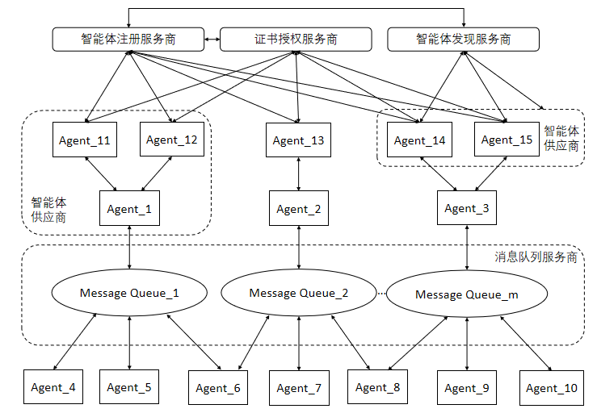
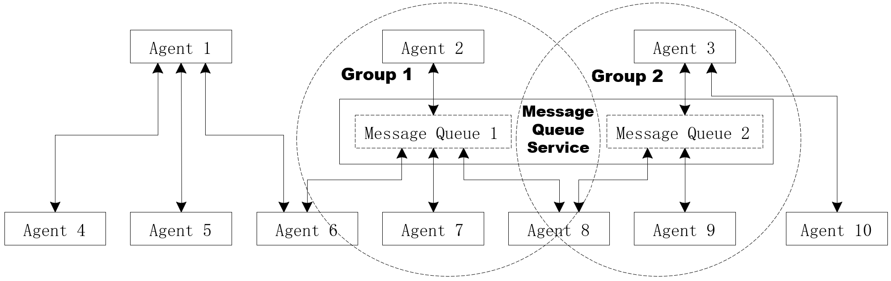

[首页](../README.md)

ACPs：面向智能体互联的智能体协作协议体系（ACPs-spec-v02.00）

# 1. 文档定义

本文档为 ACPs 智能体协作协议体系整体介绍，版本号 v02.00。

文档全称为 ACPs-spec-v02.00。

文档编写者：刘军（北京邮电大学），李珂（北京邮电大学），陈科良（北京邮电大学），禹可（北京邮电大学），胡晓峰（北京邮电大学），马镝（北京邮电大学），高歌（中国电子技术标准化研究院）。

# 2. 智能体协作协议概述

智能体互联是指智能体通过协议或接口，与其他智能体连接实现跨平台、跨领域的互联协作共同完成复杂任务的过程。智能体互联的目的，是为了突破单智能体能力限制，同时打破厂商自有多智能体框架的束缚，以开放互联的形式构建一个智能体之间可以实现平等互通、互联协作、互惠互利的平台，使得智能体之间可以自组织、自协商形成一个高效协作网络，实现根据用户任务需求动态调整资源分配和协作方式，提高智能体系统的整体能力和效率。

作为智能体互联核心基础，智能体互联相关协议，近期成为科研界和产业界的关注热点。继 Anthropic 公司提出用于连接大模型与工具之间的 Model Context Protocol（MCP）后，Google 公司提出了用于智能体之间通信的 Agent2Agent（A2A）协议。除此之外，中国的独立研究者常高伟在 2024 年 6 月也发布了面向智能体网络的 Agent Network Protocol（ANP）。更多的研究工作和成果，在最新的 Arxiv 论文《A Survey of AI Agent Protocols》中进行了较为全面的介绍。尽管这些智能体互联场景下的相关协议研究的出现，极大地推动了智能体互联的发展，但这些协议在最初设计时都仅关注了一个特定的场景，例如 MCP 重点考虑大模型如何调用工具，A2A 的目标是解决企业间智能体互联的问题，ANP 考虑相对全面，但为了保证智能体之间的自由互联空间，没有对智能体的可管理性进行太多的设计。

本文从未来智能体互联将成为关键性网络基础设施的愿景出发，在以上研究成果的基础上，尝试从更加全局化的视角，提出并设计了一套面向智能体互联的智能体协作协议体系 Agent Collaboration Protocols（ACPs）。该协议体系涵盖智能体注册、智能体发现、智能体交互等多个功能领域，以弥补现有研究的不足，为智能体互联的坚实发展提供新的思路和方法。需要特别指出的是，本文是首次构建 ACPs 协议体系，可能还存在一定的不完备和不足，我们欢迎读者指正和交流，共同完善该协议体系。

# 3. 智能体协作协议体系中的实体及相互关系

智能体协作协议体系（ACPs）中的实体及相互关系如下图所示。



智能体协作协议体系中的实体包括以下类别：

● 智能体注册服务商（Agent Registration Service Provider，ARSP）：安全可控的智能体应在智能体注册服务商进行能力注册，并获得身份标识。在智能体互联中，考虑到智能体的数量庞大、区域分布广泛，可以存在多个智能体注册服务商，每个智能体注册服务商负责管理一定数量的智能体注册。

● 证书授权服务商（Certificate Authority Service Provider，CASP）：安全可控的智能体应在可信的证书授权服务商处获得与身份标识对应的数字身份证书。在智能体互联中，考虑到智能体的数量庞大、区域分布广泛，可以存在多个证书授权服务商，每个证书授权服务商负责管理一定数量的智能体身份证书。为确保智能体身份证书发放的可靠性，证书授权服务商与智能体注册服务商需要同步信息。

● 智能体发现服务商（Agent Discovery Service Provider，ADSP）：智能体发现服务商通过规范的流程和协议，支持智能体之间识别和理解某个或若干智能体所具备的能力。考虑到智能体的数量庞大和区域分布广泛，智能体发现的查询请求呈现大量和广泛的特点，因此智能体互联中可存在多个智能体发现服务商，以便智能体或用户能够发现并利用各智能体的能力。为确保能力信息的准确性和时效性，智能体发现服务商与智能体注册服务商需要同步信息。

● 智能体（Agents）：智能体是智能体互联中的核心执行单元。每个智能体是由特定的智能体供应商（Agent Provider）创建的，并且在提供服务之前需要先在智能体注册服务商处进行注册并获得身份标识，然后从证书授权服务商获取身份证书。智能体收到用户分配的任务后，当需要其他智能体协作完成任务时，可以通过智能体发现服务商寻找合适的协作智能体，以达成任务目标。

● 消息队列（Message Queue）：消息队列是为了支持智能体之间的复杂动态交互需求而存在的消息管理组件。消息队列由特定的消息队列服务商构建并提供能力服务。由于智能体互联中智能体数量会快速增加，由此带来的交互消息数量也将十分庞大，因此会存在较多的消息队列服务商提供消息队列服务。

# 4. 智能体协作协议体系定义的规范

智能体协作协议体系（Agent Collaboration Protocols，ACPs）是为保障异构智能体之间高效协作、支持多样化智能体互联应用而设计的标准化通信与交互协议体系，ACPs 中定义了如下规范和协议：

[(1) 智能体身份码（Agent Identity Code，AIC）规范](../02-ACPs-spec-AIC/ACPs-spec-AIC.md)

[(2) 智能体能力描述（Agent Capability Specification，ACS）规范](../03-ACPs-spec-ACS/ACPs-spec-ACS.md)

[(3) 智能体可信注册（Agent Trusted Registration，ATR）规范](../04-ACPs-spec-ATR/ACPs-spec-ATR.md)

[(4) 智能体身份认证（Agent Identity Authentication，AIA）规范](../05-ACPs-spec-AIA/ACPs-spec-AIA.md)

[(5) 智能体发现协议（Agent Discovery Protocol，ADP）规范](../06-ACPs-spec-ADP/ACPs-spec-ADP.md)

[(6) 智能体交互协议（Agent Interaction Protocol，AIP）规范](../07-ACPs-spec-AIP/ACPs-spec-AIP.md)

[(7) 数据同步协议（Data Synchronization Protocol，DSP）规范](../08-ACPs-spec-DSP/ACPs-spec-DSP.md)

# 5. 各个规范的主要内容

## 5.1. 核心概念

- **用户**：智能体互联的实际使用者，通过与个人助理交互接入智能体互联。
- **个人助理智能体**：智能体的一种，直接接收用户的请求，负责将用户的需求分解成子任务并寻找合适的智能体完成这些子任务。
- **智能体身份码（Agent Identity Code，AIC）**：每个智能体具有的可认证的身份标识，其来自于智能体首次注册的智能体注册服务商。
- **智能体能力描述（Agent Capability Specification，ACS）**：采用简洁的方式对智能体能力进行具备一定灵活性的表述
- **智能体身份证书（ Certificate of Agent Identity，CAI）**：由于智能体间必须使用 HTTPS 协议进行数据传输，因此必须具有 CAI 。
- **智能体交互协议（Agent Interaction Protocol，AIP）**：多智能体系统中，上下文的管理至关重要，我们在 AIP 中定义了多种交互模式以满足不同的交互需求。


## 5.2. 智能体身份码定义

智能体互联要能成为一个安全可靠的智能体系统，其首要条件是运行于其中具备自主执行任务能力的智能体应为安全可靠的实例。要达到这一条件，每个智能体应具有可认证的身份标识，我们将其定义为智能体身份码（Agent Identity Code，AIC）。

每个智能体应具备一个唯一的 AIC，其来自于智能体首次注册的智能体注册服务商（Agent Registration Service Provider，ARSP）。在智能体互联中，可以存在多个智能体注册服务商，每个服务商应为经过共识认可（例如管理机构认证）的服务实体

智能体身份码由多层标识符顺序组成，并使用`.`符号分割，每位标识符采用阿拉伯数字或英文字母，其中阿拉伯数字的取值范围为0～9的数字，英文字母的取值范围为A~Z（不区分大小写，推荐使用大写）。以下为一个 AIC 示例：

```
1.2.156.3088.1.34C2.478BDF.3GF546.1.0SEN
```

其中 1.2.156.3088 为智能体身份码前缀，1.34C2.478BDF.3GF546.1.0SEN 为智能体身份码内容。说明：

**身份码前缀**
- （1）顶级弧：1表示ISO。
- （2）次级弧：2表示国家成员体。
- （3）第3级：156表示中国。
- （4）第4级：由国家OID注册中心批准的智能体互联专属节点。

**身份码内容**
- （5）第5级：智能体注册服务商序号（取值范围1～ZZZZZZ）。1表示一个智能体注册服务商A。
- （6）第6级：智能体供应商序号（取值范围1～ZZZZZZ）。34C2表示智能体注册服务商A分配给智能体供应商B的标识。
- （7）第7级：智能体本体序列号（取值范围1～ZZZZZZZZZ）。478BDF表示智能体注册服务商A分配给智能体供应商B的一个智能体本体序列号标识。
- （8）第8级：智能体实例序列号（取值范围0～ZZZZZZZZZ）。3GF546表示由智能体本体序列号为478BDF创建的智能体实例序列号标识。当注册对象为智能体本体时，其智能体实例序列号以特定字符0标识。
- （9）第9级：智能体身份码版本号（取值范围1~Z）。1表示智能体身份码版本为1。
- （10）第10级:校验码(取值范围0000～1EKF)。示例中的校验码为 0SEN，校验码的生成和验证方式请参考 [ACPs-spec-AIC](../02-ACPs-spec-AIC/ACPs-spec-AIC.md)。

## 5.3. 智能体能力描述

智能体互联要能成为一个安全可靠的智能体系统，需要具备的一个重要能力是支持智能体描述自身的能力并进行保存和支持获取。智能体能力描述方式既要保证一定的规范性以便于智能体之间互联互通，也需要具备一定的灵活性以适应基于大模型的智能体复杂能力表述。为达到以上目标，我们定义了智能体能力描述（Agent Capability Specification，ACS）.

关于 AgentCapabilitySpec、AgentProvider、AgentCapabilities等对象的定义请参考 [ACPs-spec-ACS](../03-ACPs-spec-ACS/ACPs-spec-ACS.md)。

## 5.4. 智能体可信注册

智能体互联要能成为一个安全可靠的智能体系统，运行于其中具备自主执行任务能力的智能体应为安全可靠的实体。要达到这一目标，每个智能体应具备以下两个必要条件：

(1) 从智能体注册服务商获得全局唯一的身份标识，该标识为智能体身份码（Agent Identity Code，AIC，详情参见 [ACPs-spec-AIC](../02-ACPs-spec-AIC/ACPs-spec-AIC.md)）；

(2) 从智能体注册服务商指定的证书授权服务商获得可用于身份验证的数字证书，称为智能体身份证书（Certificate of Agent Identity，CAI）。

满足以上两个条件的智能体注册流程，可称之为智能体可信注册流程。主要分为两个流程，分别是智能体本体注册流程和智能体实体可信注册流程。

### 5.4.1 智能体本体可信注册流程

智能体供应商向智能体注册服务商发送包含 ACS 信息的注册请求（包含 ca-challenge-url），由注册服务商人工审核通过后分配 AIC。若供应商首次向证书授权服务商（CA Server）申请证书，需先注册账户，再通过 CA Client 工具申请智能体身份证书。CA Server 依据 AIC 向智能体注册服务商获取并核对智能体详细信息，随后发起身份挑战验证。智能体供应商在指定的 Challenge Server 上完成验证信息部署，CA Server 验证通过后，生成并颁发智能体身份证书。

### 5.4.2 智能体实体可信注册流程

智能体供应商使用已获取的智能体本体证书，与智能体注册服务商建立双向认证通道（如 mTLS），提交包含本体 AIC 与额外信息的实体注册申请。智能体注册服务商依据本体证书中的 AIC 检索并自动核验对应 ACS，核验通过后生成实体序列号，结合本体 AIC 生成实体 AIC 并保存实体 ACS，再将该实体 AIC 返回给智能体供应商。智能体供应商获取实体 AIC 后，参照本体证书申请流程完成智能体实体身份证书的申请与获取。

## 5.5. 智能体身份认证

智能体互联要能成为一个安全可靠的网络基础设施，运行于其中具备自主执行任务能力的智能体应为安全可靠的实体，在 ACPs 协议体系的智能体可信注册流程标准中，为每个智能体提供了两个必要条件：智能体身份码（Agent Identity Code，AIC）、智能体身份证书（ Certificate of Agent Identity，CAI）。

智能体身份的认证可使用多种认证协议。推荐智能体之间使用 TLS1.3 协议的 mTLS 方式验证对方的证书。当用户使用个人助理时，个人助理使用 OIDC 协议验证用户的身份，用户使用 TLS1.3 协议验证个人助理身份。

## 5.6. 智能体发现

智能体互联要能成为一个安全可靠的智能体系统，需有一个规范灵活的智能体发现过程，以实现智能体之间的协作。本协议定义智能体发现过程（Agent Discovery Protocol，ADP），遵从以下原则并实现相应的目标：

（1）满足异构智能体的协作需求：服务请求智能体可以通过 ADP 机制快速发现满足其能力需求的智能体；

（2）支持动态环境下的自主协作：ADP 机制应能适应因为智能体的加入、退出或变化导致的智能体互联高动态特性，确保服务请求智能体能获取到满足其能力需求的智能体；

### 5.6.1 角色定义

● 请求智能体：请求智能体是根据任务目标需要其他智能体提供服务进行协作的服务请求发起方。

● 发现智能体：由智能体发现服务商提供的智能体，其功能是接收智能体发现请求，并返回匹配检索结果。发现智能体的信息可以通过在请求智能体所在环境中的配置获得（类似 DNS 服务器配置），也可以通过请求智能体向自己所在的智能体注册服务商发起询问获得。

● 注册智能体：由智能体注册服务器提供的智能体，其功能是对外提供智能体注册服务。

● 服务智能体：由智能体供应商创建并管理的提供服务的智能体。

### 5.6.2 智能体发现流程

（1）请求智能体对任务进行推理；

（2）请求智能体拆解出需要与其他智能体协作的任务，向发现智能体发送智能体发现请求，并携带需要协作的任务信息；

（3）注册智能体向发现智能体发送智能体描述信息，发现智能体存储该信息；注册智能体与发现智能体之间的信息同步参考 [ACPs-spec-DSP](../08-ACPs-spec-DSP/ACPs-spec-DSP.md) ;


（4）发现智能体根据请求中需要协作的任务信息与存储的智能体描述信息进行匹配；

（5）将符合需求的智能体或智能体列表信息返回给请求智能体；

（6）请求智能体根据自己的策略，从列表中选择需要协作的智能体（服务智能体），与他们进行身份验证；

（7）在身份验证成功后，请求智能体与服务智能体建立连接，共同协作完成任务。

## 5.7. 智能体交互

智能体互联要能成为一个安全可靠的智能体系统，需要一套规范的流程和协议支持智能体之间的交互。为构建一个强大、可扩展且实用的多智能体协作环境，ACPs 协议体系中的智能体交互协议（Agent Interaction Protocol，AIP）着重关注智能体之间的交互，其关键目标在于：

（1）协作性：提供标准化的机制以促进智能体间深度协作，使智能体能够主动委托任务（将子任务分配给更合适的智能体）和高效交换上下文信息（共享环境感知、目标状态、知识等）。

（2）互操作性：通过定义标准化的信息格式、语义和交互模式等，屏蔽底层智能体平台、编程语言或内部实现的差异，使由不同团队开发、运行在不同环境、具备不同能力的异构智能体系统能够无缝地发现彼此、理解交互内容并有效协作。

（3）灵活性：支持多样化的交互需求，不强制单一的交互模式，而是允许智能体根据场景选择最合适的交互模式，并能适应不同的信息负载和服务质量要求。

（4）异步性：支持长时间运行的任务，确保请求、中间状态更新和最终结果能够可靠地、按需地传递。智能体发起请求（如委托一个耗时任务）后，无需持续等待响应，可以立即处理其他事务。

### 5.7.1 角色定义

在智能体交互过程中，存在以下两种角色：

（1）领导者（Leader）：在智能体交互中，领导者是指发布任务并组织交互的智能体。在一次完整的交互中，只能有一个领导者。

（2）参与者（Partner）：在智能体交互中，参与者是指接受任务并提供服务的智能体。参与者接受来自领导者的任务后执行并返回执行结果。

### 5.7.2 交互模式

在智能体交互协议中，Leader 和 Partner 之间有三种交互模式：

（1） 直连模式（Direct Interaction Mode）：直连模式下，由 Leader 创建并维护一个 Session，相关的智能体在同一个 Session 中协作完成任务。该 Session 中 Leader 与每个 Partner 直接进行交互，而 Partner 之间无交互。Leader 与 Partner 之间的交互可以采用远程调用、流式传输和异步通知三种实现方式。

（2）群组模式（Grouping Interaction Mode）：群组模式下，由 Leader 创建并维护一个 Session，该 Session 中智能体间的交互信息通过一个消息队列（Message Queue）进行分发。Leader 创建 Session 后，邀请相关的 Partner 加入群组并在消息队列中订阅该 Session 中的信息。 然后，Leader 和 Partner 之间的交互信息发送至消息队列，然后由消息队列进行分发。同一群组内的智能体均可通过消息分发模块发送和接收消息。

（3）混合模式（Hybrid Interaction Mode）：混合模式下，由 Leader 创建并维护一个 Session，在该 Session 内，Leader 既可通过直连模式与 Partner 交互，也可通过群组模式与 Partner 交互。

### 5.7.3 交互网络

在智能体交互场景下，智能体以直连与群组两种模式与其他智能体建立连接，部分智能体可同时隶属于不同群组并复用消息队列服务，进而构成动态的智能体交互网络。某一时刻下的智能体交互结构如下图所示:



## 5.8. 数据同步协议

### 5.8.1 角色定义

- **数据提供方（Provider）** 
数据的源头​​，需要维护数据的完整性、合法性与一致性，并为数据消费方提供可靠的数据基准。

- **数据消费方（Consumer）** 
依赖数据提供方提供的数据，负责在本地消费与存储。

### 5.8.2 同步方式

数据提供方（Provider）和数据消费方（Consumer）之间的数据同步方式如下：

（1）当数据消费方首次启动、数据丢失或数据长期滞后于数据提供方的数据时，应先调用一次能力协商接口（Info API）获取数据提供方的运行状态与关键配置，据此选择合适的同步策略；随后数据消费方主动请求一次全量/增量快照（Snapshot），完成数据的初始对齐。

（2）完成对齐后进入常态化运行，即数据消费方以增量（Changes）方式持续轮询数据提供方，仅拉取新增或变更的数据，确保实时一致。若对数据同步的时效性要求更高，数据提供方可主动推送变更通知（Webhook Notification），从而降低发现侧的查询压力。

（3）若连接意外中断且时间较长，数据消费方应再次通过 Info API 评估当前保留窗口与服务状态，并在需要时重新拉取全量或增量快照，重新对齐数据，保障双方始终同步。


# 6. 补充说明

本文介绍了北邮智能体互联研究小组提出并初步定义的面向智能体互联的智能体协作协议体系（Agent Collaboration Protocols，ACPs）。ACPs 协议体系的提出，是从未来智能体互联能成为关键性网络基础设施的角度出发，尝试从更加全局化的视野，为智能体互联的坚实发展提供新的思路和方法。需要特别说明的是，本文是研究团队首次阐述 ACPs 协议体系的基本框架和思路，在具体实现层面可能还存在一定的不足，我们欢迎读者指正和交流，共同完善该协议体系。在后续工作中，我们将基于 ACPs 框架进一步进行细化，阐述 ACPs 协议体系的实现细节和参考实现。
