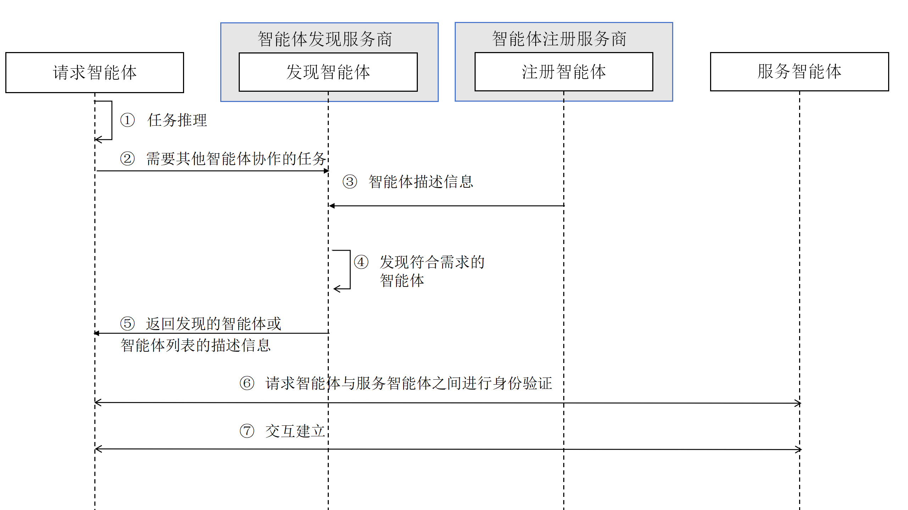

[首页](../README.md)

ADP：智能体发现过程（ACPs-spec-ADP-v02.00）

# 1. 文档定义

本文档为 ACPs 智能体协作协议体系中的智能体发现流程（Agent Discovery Protocol，ADP）标准定义，版本号 v02.00。

文档全称为 ACPs-spec-ADP-v02.00。

文档编写者：李珂（北京邮电大学），张茂彬（北京邮电大学），王垚烨（北京邮电大学），禹可（北京邮电大学），胡晓峰（北京邮电大学），刘军（北京邮电大学），马镝（北京邮电大学），陈科良（北京邮电大学）。

# 2. 智能体发现流程介绍

智能体互联要能成为一个安全可靠的智能体系统，需有一个规范灵活的智能体发现过程，以实现智能体之间的协作。本文档定义智能体发现过程（Agent Discovery Protocol，ADP），遵从以下原则并实现相应的目标：

(1) 满足异构智能体的协作需求：服务请求智能体可以通过 ADP 机制快速发现满足其能力需求的智能体；

(2) 支持动态环境下的自主协作：ADP 机制应能适应因为智能体的加入、退出或变化导致的智能体互联高动态特性，确保服务请求智能体能获取到满足其能力需求的智能体；

# 3. 智能体发现流程中的角色定义和交互过程

智能体发现流程中涉及的角色与交互过程如下图所示。


智能体发现流程涉及以下角色：

● 请求智能体：请求智能体是根据任务目标需要其他智能体提供服务进行协作的服务请求发起方。

● 发现服务器：由智能体发现服务提供方提供的服务节点，其功能是接收智能体发现请求，并返回匹配检索结果。请求智能体可以通过本地配置或所在环境中的服务发现机制获得发现服务器地址。

● 注册服务器：由智能体注册服务提供方提供的服务节点，其功能是对外提供智能体注册信息。发现服务器可以通过《DSP：数据同步协议》同步智能体描述信息。

● 服务智能体：由智能体供应商创建并管理的提供服务的智能体。

智能体发现流程包括以下步骤：

(1) 请求智能体对任务进行推理；

(2) 请求智能体拆解出需要与其他智能体协作的任务，向发现服务器发送智能体发现请求，并携带需要协作的任务信息；

(3) 发现服务器基于本地维护的智能体目录进行匹配检索；目录可由注册信息及相关状态信息构成，其同步机制可参考《DSP：数据同步协议》；

(4) 发现服务器根据请求中需要协作的任务信息与存储的智能体描述信息进行匹配；

(5) 发现服务器将符合需求的智能体或智能体列表信息返回给请求智能体；

(6) 请求智能体根据自己的策略，从列表中选择需要协作的智能体（服务智能体），与其进行身份验证；

(7) 在身份验证成功后，请求智能体与服务智能体建立连接，共同协作完成任务。

# 4. 智能体发现（Discovery）API

请求智能体通过此 API 与发现服务器交互，以发现满足其任务需求的服务智能体。

## 4.1. API 规范

### 4.1.1. 发现请求 API 规范

- **接口描述**：供请求智能体发现满足特定能力需求的服务智能体。
- **认证方式**：`mTLS`。请求智能体需提供有效证书。
- **请求方式**：`POST`
- **请求 URL**：`{ADP_BASE_URL}/discover`
- **请求体**：`DiscoveryRequest`
- **响应体**：`DiscoveryResponse`
- **响应码**：
  - 200 OK：请求成功。
  - 307 Temporary Redirect：重定向到一个仅对本次请求有效的目标发现服务器。附带 `Location` 响应头指示新地址。响应体中 `error.code` 指明重定向原因。
  - 400 Bad Request：请求参数非法。
  - 401 Unauthorized：证书无效。
  - 429 Too Many Requests：调用频率超出限制，并携带 `Retry-After` 响应头指示重试时间。
  - 508 Loop Detected：检测到转发环路、转发深度超限或转发额度不足。
  - 500 Internal Server Error：服务端异常。
- **关于排序**：
  - 响应结果中的候选服务智能体列表应按匹配度从高到低排序。
  - 排序算法由发现服务器实现决定，但响应中的顺序应能直接用于候选选择。
- **307 Temporary Redirect 语义**：
  - 发现服务器因资源、策略或地域覆盖限制无法完成当前查询时，可返回 307，并在响应头中附带 `Location` 指向推荐的目标发现服务器；
  - 重定向只针对当前请求生效，客户端不得缓存该地址，也不得在后续请求中默认使用；
  - 客户端收到 307 后应携带原始请求体与 mTLS 凭据向新地址重新发起一次查询；
  - 若连续收到多个 307，客户端可根据自身策略决定继续重定向还是上报失败，建议最大跳转次数不超过 5 次。

### 4.1.2. 错误码定义

响应体中的错误码（`error.code`）定义：

| 错误码 | 含义                      | 说明                                                                                                                                         |
| ------ | ------------------------- | -------------------------------------------------------------------------------------------------------------------------------------------- |
| 30701  | CapacityRedirect          | 当前发现服务器负载或维护受限，返回 307 并在 `Location` 中提供候选服务器。                                                                    |
| 30702  | RegionRedirect            | 因地域或合规策略不覆盖该查询，返回 307 指引到覆盖区域的发现服务器。                                                                          |
| 30703  | MaxRedirectsExceeded      | 客户端连续重定向次数超过限制，请求被拒绝。                                                                                                   |
| 40001  | MissingQuery              | `type=explicit` 时缺少 `query`，或文本为空字符串。                                                                                           |
| 40002  | ForwardDepthLimitInvalid  | `forwardDepthLimit` 不在 1-5 区间。                                                                                                          |
| 40003  | ForwardChainInvalid       | 客户端携带的 `forwardChain` 包含非法 AIC。                                                                                                   |
| 40004  | FilterInvalid             | `filter` 中的条件不合法，或条件互相矛盾。                                                                                                    |
| 40005  | ForwardFanoutLimitInvalid | `forwardFanoutLimit` 不在 1-5 区间，或小于 1。                                                                                               |
| 40101  | CertificateInvalid        | mTLS 证书无效、过期或被吊销。                                                                                                                |
| 42901  | CallerRateLimited         | 针对单个请求智能体的调用频率超限，需遵守 `Retry-After`。                                                                                     |
| 42902  | TenantRateLimited         | 上层租户或组织的配额已用尽，需遵守 `Retry-After`。                                                                                           |
| 50801  | ForwardLoopDetected       | 在 `forwardChain` 中发现自身 AIC，判定存在环路。                                                                                             |
| 50802  | ForwardDepthExceeded      | 转发深度达到 `forwardDepthLimit`，不再继续转发。                                                                                             |
| 50803  | ForwardChainTampered      | 校验 `forwardChain` 最后一个 AIC 与当前请求证书内嵌 AIC 不同，链条完整性受到破坏。                                                           |
| 50804  | ForwardFanoutExceeded     | 聚合转发尝试的分支数量超过剩余额度，或剩余额度分配之和超出允许范围。服务器应在 `error.data` 中给出 `availableBudget` 与 `requiredBranches`。 |
| 50805  | ForwardSignatureInvalid   | `forwardSignatures` 中的签名验证失败，可能被篡改或签名不匹配。                                                                               |
| 50001  | InternalError             | 发现服务器自身异常，无法完成查询。                                                                                                           |

### 4.1.3. 多发现服务器协作的公共语义

ADP 允许多个发现服务器协作，以覆盖更广泛的能力目录并提高可用性。对外可见的协作模式包括：

- **重定向（Redirect）**：当前节点不参与查询，转而指引请求方直接访问其它发现服务器；
- **链式转发（Forwarding）**：当前节点代表请求方向其它发现服务器继续查询，并将结果透传；
- **聚合转发（Fan-out + Aggregation）**：当前节点向多个发现服务器并发查询，并对返回的候选做汇总。

公共字段语义如下：

- `forwardChain`：记录请求在发现服务器之间经过的 AIC 链路。原始请求通常不携带该字段，由转发路径上的发现服务器逐跳维护。
- `forwardDepthLimit`：单条链路允许的最大转发深度。服务器默认值可为 3，绝对上限为 5。
- `forwardFanoutLimit`：允许的最大并发下游请求数量。服务器默认值可为 1，绝对上限为 5。未提供时，发现服务器不得主动发起多路并发转发。
- `forwardFanoutRemaining`：当前分支尚可消耗的 fan-out 额度。该值由发现服务器在转发过程中维护。
- `forwardTrustedServers`：入口发现服务器提供的可信发现服务器 AIC 列表，用于约束后续的转发目标。
- `forwardSignatures`：由转发路径上的发现服务器附加的签名列表，用于保护链路完整性。
- `acsMap`：全局唯一的 ACS 数据仓库，至少包含 `agents` 中所有 AIC 的 ACS 数据。
- `agents`：发现到的候选智能体列表，是客户端消费的主要结果。
- `routes`：可选，逐条返回各条链式或聚合路径上的技能信息，主要用于调试和归因。

具体的路由选择、缓存、索引、去重和排序实现由发现服务器决定，但其行为必须符合本规范定义的数据结构和响应语义。

### 4.1.4. 批量、重试与缓存

- **不支持批量发现请求**：请求智能体可以通过并发发送多个发现请求来实现批量发现需求。本文档不定义在单个请求中包含多个查询的批量接口。
- **重试策略建议**：
  - 对于 4xx 错误需修正参数后再发起请求；如果是 429 错误，应尊重 `Retry-After` 指示的等待时间后再重试；
  - 对于 5xx 或网络错误，建议采用指数退避重试。
- **缓存建议**：
  - 请求智能体可根据自身策略缓存发现结果，以减少重复查询和降低延迟；
  - 发现服务器可在响应头中使用标准 HTTP 缓存控制字段（如 `Cache-Control`、`ETag`）来指示响应的缓存策略。

## 4.2. 数据结构

### 4.2.1. 数据结构定义

```typescript
export interface DiscoveryRequest {
  /**
   * 查询类型。
   * - explicit: 明确查询（默认值），`query` 的内容是有明确意图的，并按照 `filter` 过滤。
   * - exploratory：探索性查询，用户没有明确目标，希望系统“给些有趣内容”。`query` 可以为空，或者内容较为宽泛。
   * - trending：热门查询，希望系统返回当前流行的智能体。`query` 可以为空，或者内容较为宽泛。
   * - filtered：过滤查询，只按照 `filter` 过滤，`query` 应该为空，不为空也会被忽略。
   * @example explicit
   */
  type?: string;

  /**
   * 能力查询，自然语言描述的请求智能体所需的服务能力。
   * type = explicit 时该字段必填。
   * @example "我需要一个可以做北京美食推荐的智能体"
   */
  query?: string;

  /**
   * 结构化上下文信息。
   * 可用于携带多轮对话摘要、用户画像切片或其它辅助意图理解的数据，帮助发现服务器更精准地匹配能力。
   * 推荐使用轻量的 JSON 结构并控制在约定的载荷大小（建议 <2KB），字段含义由上下游约定。
   * 需要注意的是，该字段可能会被多个发现服务器转发和处理，调用方应避免携带敏感信息。
   * @example {
   *   "recentTurns": ["上一轮询问了北京菜系", "用户偏好健康饮食"],
   *   "userProfile": { "city": "北京", "budget": "medium" }
   * }
   */
  context?: DiscoveryContext;

  /**
   * 最大返回数量
   * 指定返回的候选服务智能体的最大数量，如果未指定则使用服务器默认值。
   * 由于发现服务器可能会进行多跳转发和聚合，不适合做分页处理，所以采取限制总量的方式控制响应大小。
   * @example 5
   */
  limit?: number;

  /**
   * 结构化过滤条件。
   * 采用通用条件数组模式对 ACS 字段进行匹配，支持丰富的运算符和逻辑组合。
   * 详见 4.2.2 节的 ACS 过滤说明。
   */
  filter?: DiscoveryFilter;

  /**
   * 单条链路允许的最大转发深度。服务器默认 3，绝对上限 5，超过会被视为非法请求。
   */
  forwardDepthLimit?: number;

  /**
   * 允许的最大并发下游请求数量。服务器默认 1，绝对上限 5，超过会被视为非法请求。
   * 若未提供该字段，即默认为 1，发现服务器不得主动发起多路并发转发。
   */
  forwardFanoutLimit?: number;

  /**
   * 当前分支尚可消耗的 fan-out 额度。
   * 原始请求通常不设置，由第一跳发现服务器根据 forwardFanoutLimit 初始化，随后每次转发需扣减并传递。
   */
  forwardFanoutRemaining?: number;

  /**
   * 转发追踪链。
   * 转发链的类型为字符串数组，每个字符串为一个智能体身份码（AIC）。
   * 原始请求无需携带该字段。由每一跳的发现服务器依次维护。每转发一次需将自身 AIC 追加到列表，用于检测环路。
   * 转发链中的最后一个 AIC 应与当前请求的 mTLS 证书中携带的 AIC 一致，以确保链条完整性。
   * 转发链中数据的顺序为从最初请求的发现服务器到当前服务器的顺序。
   */
  forwardChain?: string[];

  /**
   * 信任的发现服务器 AIC 列表。
   * 由首个接收请求的发现服务器（入口节点）根据自身的信任配置填充，不是由请求智能体提供。
   * 后续节点在进行转发（链式或聚合）时，应仅向列表中的 AIC 对应的发现服务器转发，
   * 以确保最终结果的可信度。
   */
  forwardTrustedServers?: string[];

  /**
   * 转发发现服务器的数字签名。签名使用 mTLS 证书对应私钥生成。
   * 由每一跳的发现服务器在转发前生成并附加，用于保证转发链的完整性和防篡改。
   * 顺序与 forwardChain 保持一致，每个签名对应 forwardChain 中的同一位置的 AIC。
   * 签名内容为对 forwardChain 和 forwardTrustedServers 的哈希值进行签名。也可以添加请求中其他重要字段以增强完整性保护。
   * 后续节点在接收请求时，应使用来源发现服务器（也就是 forwardChain 最后一个）的 AIC 对应的公钥验证签名的有效性，确保转发链未被篡改。
   */
  forwardSignatures?: string[];

  /**
   * 每次转发的请求超时，单位毫秒。缺省可为 10000ms。
   * 用于控制单跳的最大等待时间，防止单个节点阻塞整体响应。
   * 此值为配置，不需要根据剩余时间动态调整。
   */
  forwardEachTimeoutMs?: number;

  /**
   * 转发请求的总超时，单位毫秒。缺省可为 60000ms。
   * 用于控制整个转发链的最大等待时间，防止整体响应超时。
   * 此值需要根据剩余时间对下一跳做动态调整，确保在总超时范围内完成。
   * 当 forwardTotalTimeoutMs 剩余值小于 forwardEachTimeoutMs 时，就不应该继续转发。
   */
  forwardTotalTimeoutMs?: number;
}

/**
 * 上下文载荷结构。
 * 旨在描述请求侧可选的会话与用户背景切片，供发现服务器理解意图。
 */
export interface DiscoveryContext {
  /**
   * 客户端自定义的会话 ID，用于关联多轮查询。
   */
  conversationId?: string;

  /**
   * 近期对话摘要或要点。
   * 建议按时间排序，避免携带完整原始对话以控制大小。
   */
  recentTurns?: string[];

  /**
   * 匿名化用户画像片段，如地理位置、预算偏好等。
   */
  userProfile?: Record<string, any>;

  /**
   * 额外的上下文扩展，供上下游约定使用。
   */
  metadata?: Record<string, any>;
}

/**
 * 过滤条件集合。
 * 采用通用条件数组模式，支持逻辑组合（AND/OR/NOT），可对 ACS 中所有可查询字段进行匹配。
 * 各条件之间的逻辑关系由 logic 字段控制（默认 AND）。
 * 支持通过 groups 嵌套子条件组，实现任意复杂的逻辑表达。
 * 详见 4.2.2 节的 ACS 过滤说明。
 */
export interface DiscoveryFilter {
  /** 过滤条件列表。与 groups 中的子条件组按 logic 指定的逻辑关系组合。 */
  conditions?: FilterCondition[];

  /**
   * 嵌套的子条件组，每个子组可拥有独立的 logic。
   * 建议嵌套不超过 3 层，以保持可读性和转发性能。
   */
  groups?: DiscoveryFilter[];

  /**
   * 本层条件和子条件组之间的逻辑关系。
   * - "and"（默认）：所有条件和子组均须满足。
   * - "or"：至少一个条件或子组满足即可。
   * - "not"：对本层整体结果取反。
   * @default "and"
   */
  logic?: "and" | "or" | "not";
}

/**
 * 单个过滤条件，描述对 ACS 某个字段施加的匹配规则。
 */
export interface FilterCondition {
  /**
   * 字段路径，使用点号分隔表示嵌套。
   * 对于数组字段，条件应用于每个元素，任意元素满足即匹配。
   * 支持的字段路径详见 4.2.2 节。
   */
  field: string;

  /** 匹配运算符，详见 FilterOperator。 */
  op: FilterOperator;

  /**
   * 匹配值。类型取决于 field 的数据类型和 op 运算符：
   * - 字符串运算符：value 为 string
   * - 列表运算符（in/nin）：value 为同类型值的数组
   * - 数值/日期比较运算符：value 为 number 或 ISO 8601 字符串
   * - 区间运算符（between）：value 为 [lower, upper] 二元组
   * - 布尔运算符：value 为 boolean
   * - 存在性运算符（exists）：value 为 boolean
   * - 数组运算符（anyOf/allOf/noneOf）：value 为期望匹配的值数组
   * - 数组大小运算符（size）：value 为 number
   * - Map 键运算符（hasKey/hasAnyKey/hasAllKeys）：value 为 string 或 string[]
   */
  value?: any;
}

/**
 * 过滤运算符。
 *
 * 通用：eq（等于）、ne（不等于）、exists（字段存在性，value: boolean）。
 * 比较：gt、gte、lt、lte（数值/日期/字符串字典序）、between（闭区间 [lower, upper]）。
 * 集合：in（值在列表中）、nin（值不在列表中）。
 * 字符串：contains、notContains、startsWith、endsWith。
 * 大小写敏感：上述适用于字符串的运算符默认大小写不敏感；加 Cs 后缀表示大小写敏感，
 *   如 eqCs、neCs、inCs、ninCs、containsCs、notContainsCs、startsWithCs、endsWithCs。
 * 数组：anyOf（至少包含一个）、allOf（全部包含）、noneOf（不包含任何）、size（长度等于）。
 * Map/对象：hasKey（包含键）、hasNoKey（不包含键）、hasAnyKey（包含任一键）、hasAllKeys（包含全部键）。
 *
 * 注：字符串的 gt/gte/lt/lte 按字典序比较，主要用于版本号等场景。
 */
export type FilterOperator =
  // ── 通用：等值与存在性 ──
  | "eq"
  | "ne"
  | "exists"
  // ── 比较：数值、日期、字符串字典序 ──
  | "gt"
  | "gte"
  | "lt"
  | "lte"
  | "between"
  // ── 集合：值列表匹配 ──
  | "in"
  | "nin"
  // ── 字符串：模式匹配（默认大小写不敏感） ──
  | "contains"
  | "notContains"
  | "startsWith"
  | "endsWith"
  // ── 字符串：大小写敏感变体（Cs = Case Sensitive） ──
  | "eqCs"
  | "neCs"
  | "inCs"
  | "ninCs"
  | "containsCs"
  | "notContainsCs"
  | "startsWithCs"
  | "endsWithCs"
  // ── 数组：集合运算 ──
  | "anyOf"
  | "allOf"
  | "noneOf"
  | "size"
  | "sizeGt"
  | "sizeGte"
  | "sizeLt"
  | "sizeLte"
  // ── Map/对象：键检查 ──
  | "hasKey"
  | "hasNoKey"
  | "hasAnyKey"
  | "hasAllKeys";

/**
 * 通用响应结构。具体的响应结构需要继承此接口并补充 result 字段。
 * 调用成功时包含 result 字段，调用失败时包含 error 字段，二者互斥。
 */
export interface CommonResponse {
  /**
   * 方法调用的结果
   * 如果调用成功则包含结果，与error字段相互排斥。
   * @example { "type": "task", "id": "task-001" }
   */
  result?: any;

  /**
   * 错误信息
   * 如果调用失败则包含错误对象，与result字段相互排斥。
   */
  error?: {
    /**
     * 错误代码
     * @example -32602
     */
    code: number;

    /**
     * 错误消息
     * 描述错误的简要信息。
     * @example "Invalid Request"
     */
    message: string;

    /**
     * 可选的错误数据
     * 提供更多的错误细节和上下文信息。
     * @example { "errorType": "CONNECTION_FAILED" }
     */
    data?: any;
  };
}

/**
 * 发现响应。
 */
export interface DiscoveryResponse extends CommonResponse {
  /**
   * 请求结果
   * 调用成功时返回匹配到的服务智能体列表。
   */
  result?: DiscoveryResult;
}

/**
 * 发现结果。
 */
export interface DiscoveryResult {
  /**
   * 发现结果中涉及的智能体 ACS 数据。
   * 键为智能体身份码（AIC），值为该智能体的完整能力描述（ACS）。
   * 至少包含 agents 中所有 AIC 的 ACS 数据；发现服务器可按需包含 routes 中出现的额外 AIC，但不做强制要求。
   * DiscoveryAgentSkill 中的 aic 字段可作为此映射的查找键。
   */
  acsMap: Record<string, Record<string, any>>;

  /**
   * 发现到的候选智能体列表。
   * 当进行了多路聚合时为去重排序后的结果，便于客户端直接使用；
   * 未进行聚合时与 routes 中唯一路径的 agentGroups 一致。
   */
  agents: DiscoveryAgentGroup[];

  /**
   * 下游响应路由集合（可选）。
   * 每条路由对应一次链式或聚合转发路径及其候选技能。
   * 主要用于调试和归因，客户端正常使用时可只关注 agents 和 acsMap。
   */
  routes?: DiscoveryRoute[];
}

/**
 * 发现结果的路由级细分。
 */
export interface DiscoveryRoute {
  /**
   * 转发链路所经过的发现服务器 AIC 列表。
   * 顺序从第一跳（接收到原始请求的发现服务器）到最终返回结果的发现服务器。
   */
  forwardChain: string[];

  /**
   * 此链路返回的按分组组织的候选服务智能体列表。
   * 每个分组对应一个查询维度（如子任务、类别等）。
   * 若业务无需分组，仍应返回包含单个默认分组的数组，以保持结构统一。
   */
  agentGroups: DiscoveryAgentGroup[];

  /**
   * 该链路的响应状态。
   * - ok：成功返回结果。
   * - timeout：下游节点超时。
   * - error：其它错误。
   */
  status?: "ok" | "timeout" | "error";

  /**
   * 该链路的总耗时（毫秒）。
   */
  durationMs?: number;

  /**
   * 额外的链路级扩展信息。
   */
  metadata?: Record<string, any>;
}

/**
 * 按分组组织的智能体匹配结果。
 * 发现服务器可将查询拆解为多个子任务或类别，每个分组对应一个维度。
 * 若无需分组，使用单条默认分组（如 group 为原始查询文本或空字符串）。
 */
export interface DiscoveryAgentGroup {
  /**
   * 分组标识。
   * 可以是子任务描述、类别名称等，用于标识该组结果的来源或维度。
   * 若无分组需求，可设为原始查询文本或空字符串。
   */
  group: string;

  /**
   * 该分组下匹配到的智能体技能列表。
   */
  agentSkills: DiscoveryAgentSkill[];
}

/**
 * 单个智能体技能的匹配结果。
 */
export interface DiscoveryAgentSkill {
  /**
   * 智能体身份码（AIC）。
   * 用于关联 DiscoveryResult.acsMap 中的完整 ACS 信息。
   */
  aic: string;

  /**
   * 在 ACS 中匹配的 Skill ID。
   */
  skillId: string;

  /**
   * 匹配排名。
   * 排名顺序是数字的自然顺序，数字值越大排名越靠后。
   */
  ranking: number;

  /**
   * 备注信息。
   */
  memo?: string;
}
```

### 4.2.2. ACS 过滤说明

`DiscoveryFilter` 采用通用的「条件数组 + 逻辑组合」模式（借鉴 MongoDB Query / SCIM 2.0 的运算符命名），具有以下设计优势：

- **JSON 原生**：直接嵌入请求体，无需字符串解析。
- **统一机制**：一套 `{ field, op, value }` 结构覆盖所有 ACS 字段类型，字段增减不改协议结构。
- **逻辑组合**：通过嵌套 `groups` + `logic` 支持任意深度的 AND/OR/NOT。
- **转发透传**：中间发现服务器可直接转发过滤条件，无需理解每个字段的语义。

发现服务器在收到过滤条件后，应校验字段路径合法性、运算符与字段类型的兼容性，以及嵌套深度是否超限（建议不超过 3 层）。不合法的条件应返回错误码 40004（FilterInvalid）。

#### 运算符适用表

| 运算符        | 字符串 | 数值 | 布尔 | 日期时间 | 数组 | Map/对象 | 说明                                   |
| ------------- | ------ | ---- | ---- | -------- | ---- | -------- | -------------------------------------- |
| eq            | ✓      | ✓    | ✓    | ✓        |      |          | 等于                                   |
| ne            | ✓      | ✓    | ✓    | ✓        |      |          | 不等于                                 |
| gt            | ✓¹     | ✓    |      | ✓        |      |          | 大于                                   |
| gte           | ✓¹     | ✓    |      | ✓        |      |          | 大于等于                               |
| lt            | ✓¹     | ✓    |      | ✓        |      |          | 小于                                   |
| lte           | ✓¹     | ✓    |      | ✓        |      |          | 小于等于                               |
| between       |        | ✓    |      | ✓        |      |          | 闭区间 [lower, upper]                  |
| in            | ✓      | ✓    |      |          |      |          | 值在给定列表中                         |
| nin           | ✓      | ✓    |      |          |      |          | 值不在给定列表中                       |
| contains      | ✓      |      |      |          |      |          | 包含子串                               |
| notContains   | ✓      |      |      |          |      |          | 不包含子串                             |
| startsWith    | ✓      |      |      |          |      |          | 以指定前缀开头                         |
| endsWith      | ✓      |      |      |          |      |          | 以指定后缀结尾                         |
| eqCs          | ✓      |      |      |          |      |          | 等于（大小写敏感）                     |
| neCs          | ✓      |      |      |          |      |          | 不等于（大小写敏感）                   |
| inCs          | ✓      |      |      |          |      |          | 值在给定列表中（大小写敏感）           |
| ninCs         | ✓      |      |      |          |      |          | 值不在给定列表中（大小写敏感）         |
| containsCs    | ✓      |      |      |          |      |          | 包含子串（大小写敏感）                 |
| notContainsCs | ✓      |      |      |          |      |          | 不包含子串（大小写敏感）               |
| startsWithCs  | ✓      |      |      |          |      |          | 以指定前缀开头（大小写敏感）           |
| endsWithCs    | ✓      |      |      |          |      |          | 以指定后缀结尾（大小写敏感）           |
| exists        | ✓      | ✓    | ✓    | ✓        | ✓    | ✓        | 字段是否存在且非空（value=true/false） |
| anyOf         |        |      |      |          | ✓    |          | 数组包含给定值中的至少一个             |
| allOf         |        |      |      |          | ✓    |          | 数组包含给定值中的全部                 |
| noneOf        |        |      |      |          | ✓    |          | 数组不包含给定值中的任何一个           |
| size          |        |      |      |          | ✓    |          | 数组长度等于指定值                     |
| sizeGt        |        |      |      |          | ✓    |          | 数组长度大于指定值                     |
| sizeGte       |        |      |      |          | ✓    |          | 数组长度大于等于指定值                 |
| sizeLt        |        |      |      |          | ✓    |          | 数组长度小于指定值                     |
| sizeLte       |        |      |      |          | ✓    |          | 数组长度小于等于指定值                 |
| hasKey        |        |      |      |          |      | ✓        | Map/对象包含指定键                     |
| hasNoKey      |        |      |      |          |      | ✓        | Map/对象不包含给定键中的任何一个       |
| hasAnyKey     |        |      |      |          |      | ✓        | Map/对象包含给定键中的至少一个         |
| hasAllKeys    |        |      |      |          |      | ✓        | Map/对象包含给定键中的全部             |

> 注¹：字符串的 gt/gte/lt/lte 按字典序比较，主要用于版本号比较等场景。
>
> 注²：适用于字符串的运算符（eq、ne、in、nin、contains、notContains、startsWith、endsWith）默认按**大小写不敏感**方式匹配。若需大小写敏感匹配，使用对应的 `Cs` 后缀变体（如 `eqCs`、`containsCs`）。Cs 变体仅适用于字符串类型。

#### 过滤示例

**示例 1：简单条件（AND 逻辑）**

查询 active 且协议版本为 02.00、支持 JSONRPC、有流式响应的智能体：

```json
{
  "conditions": [
    { "field": "active", "op": "eq", "value": true },
    { "field": "protocolVersion", "op": "in", "value": ["02.00"] },
    { "field": "endPoints.transport", "op": "in", "value": ["JSONRPC"] },
    { "field": "capabilities.streaming", "op": "eq", "value": true },
    { "field": "skills.tags", "op": "anyOf", "value": ["数据处理", "北京"] }
  ]
}
```

**示例 2：日期范围 + 版本比较**

查询 2025 年内更新且版本 ≥ 2.0.0 的智能体：

```json
{
  "conditions": [
    {
      "field": "lastModifiedTime",
      "op": "between",
      "value": ["2025-01-01T00:00:00+08:00", "2025-12-31T23:59:59+08:00"]
    },
    { "field": "version", "op": "gte", "value": "2.0.0" }
  ]
}
```

**示例 3：OR 逻辑 - 跨字段组合**

查询 (streaming=true 且组织含“大学”) 或 (有 OIDC 认证且支持 MQTT) 的智能体：

```json
{
  "logic": "or",
  "groups": [
    {
      "conditions": [
        { "field": "capabilities.streaming", "op": "eq", "value": true },
        { "field": "provider.organization", "op": "contains", "value": "大学" }
      ]
    },
    {
      "conditions": [
        { "field": "securitySchemes", "op": "hasKey", "value": "oidc" },
        {
          "field": "capabilities.messageQueue",
          "op": "anyOf",
          "value": ["mqtt:5.0"]
        }
      ]
    }
  ]
}
```

**示例 4：NOT 逻辑 - 排除特定组织**

```json
{
  "conditions": [
    { "field": "active", "op": "eq", "value": true },
    { "field": "provider.organization", "op": "nin", "value": ["某黑名单组织"] }
  ]
}
```

**示例 5：存在性与数组长度检查**

查询有服务端点、有 Web 应用 URL、且至少有 3 个技能的智能体：

```json
{
  "conditions": [
    { "field": "endPoints", "op": "exists", "value": true },
    { "field": "webAppUrl", "op": "exists", "value": true },
    { "field": "skills", "op": "sizeGte", "value": 3 }
  ]
}
```

**示例 6：AIC 前缀匹配**

```json
{
  "conditions": [{ "field": "aic", "op": "startsWith", "value": "1000100001" }]
}
```

### 4.2.3. 其它说明

`DiscoveryContext` 的字段仅作建议，调用方与发现服务器可根据场景扩展更多键值，并应约定安全策略与最大载荷，确保在服务端风控限制内安全传输。

`agents` 和 `acsMap` 是客户端消费的主要字段。`acsMap` 位于 `DiscoveryResult` 顶层，是全局唯一的 ACS 数据仓库，至少包含 `agents` 中所有 AIC 的 ACS 数据；发现服务器可按需包含 `routes` 中出现的额外 AIC，但不做强制要求。客户端不应假设 `routes` 中引用的 AIC 一定能在 `acsMap` 中查到。

聚合转发时，发现服务器需要为每个下游请求维护独立的 `DiscoveryRoute`，并在 `agents` 中返回去重排序后的汇总结果。`routes` 为可选字段，主要用于调试和归因；若某条路由失败，可通过 `status` 字段体现具体原因，便于请求智能体做容错处理。

`agents` 和 `DiscoveryRoute.agentGroups` 中的 `DiscoveryAgentGroup` 至少应包含一个分组。若业务无需分组（如简单的单意图查询），仍应返回包含单个默认分组的数组，`group` 可设为原始查询文本或空字符串，以保持响应结构统一。

## 4.3. 示例请求与响应

本节展示典型的对外调用场景。示例中包含分布式追踪字段 `X-Trace-Id` 和 `X-Span-Id` 等，字段名称仅为示例，实际使用中可根据系统日志规范扩展。

### 4.3.1. 基本查询（明确查询）

**请求示例**

```http
POST /discover HTTP/1.1
Host: ds-a.example.com
Content-Type: application/json
X-Trace-Id: trace-20251125-abcd1234
X-Span-Id: span-client-001

{
  "type": "explicit",
  "query": "我需要一个可以做北京美食推荐的智能体",
  "limit": 5
}
```

**响应示例**

```http
HTTP/1.1 200 OK
Content-Type: application/json
Cache-Control: max-age=300
X-Trace-Id: trace-20251125-abcd1234
X-Span-Id: span-ds-a-001

{
  "result": {
    "acsMap": {
      "AIC-AGENT-FOOD-01": {
        "name": "BeijingFoodGuide",
        "description": "专业的北京美食推荐智能体",
        "provider": { "organization": "FoodTech Inc." }
      },
      "AIC-AGENT-CUISINE-01": {
        "name": "ChinaCuisineBot",
        "description": "中国各地美食推荐",
        "provider": { "organization": "TravelAI" }
      }
    },
    "agents": [
      {
        "group": "我需要一个可以做北京美食推荐的智能体",
        "agentSkills": [
          {
            "aic": "AIC-AGENT-FOOD-01",
            "skillId": "skill-beijing-food-001",
            "ranking": 1
          },
          {
            "aic": "AIC-AGENT-CUISINE-01",
            "skillId": "skill-china-cuisine-002",
            "ranking": 2
          }
        ]
      }
    ],
    "routes": [
      {
        "forwardChain": ["AIC-DS-A"],
        "agentGroups": [
          {
            "group": "我需要一个可以做北京美食推荐的智能体",
            "agentSkills": [
              {
                "aic": "AIC-AGENT-FOOD-01",
                "skillId": "skill-beijing-food-001",
                "ranking": 1
              },
              {
                "aic": "AIC-AGENT-CUISINE-01",
                "skillId": "skill-china-cuisine-002",
                "ranking": 2
              }
            ]
          }
        ],
        "status": "ok",
        "durationMs": 150
      }
    ]
  }
}
```

### 4.3.2. 带过滤器的查询

**请求示例**

```http
POST /discover HTTP/1.1
Host: ds-a.example.com
Content-Type: application/json
X-Trace-Id: trace-20251125-efgh5678
X-Span-Id: span-client-002

{
  "type": "explicit",
  "query": "我需要一个支持流式响应的数据分析智能体",
  "limit": 3,
  "filter": {
    "conditions": [
      { "field": "active", "op": "eq", "value": true },
      { "field": "endPoints.transport", "op": "in", "value": ["JSONRPC"] },
      { "field": "capabilities.streaming", "op": "eq", "value": true },
      { "field": "provider.countryCode", "op": "in", "value": ["CN", "US"] }
    ]
  },
  "context": {
    "conversationId": "conv-12345",
    "recentTurns": ["用户询问了销售数据趋势"],
    "userProfile": {
      "industry": "retail",
      "dataSize": "large"
    }
  }
}
```

**响应示例**

```http
HTTP/1.1 200 OK
Content-Type: application/json
Cache-Control: max-age=300
X-Trace-Id: trace-20251125-efgh5678
X-Span-Id: span-ds-a-002

{
  "result": {
    "acsMap": {
      "AIC-AGENT-STREAM-01": {
        "name": "StreamAnalyzer",
        "description": "支持流式响应的大数据分析智能体",
        "capabilities": { "streaming": true },
        "provider": { "organization": "DataCorp", "countryCode": "CN" }
      }
    },
    "agents": [
      {
        "group": "我需要一个支持流式响应的数据分析智能体",
        "agentSkills": [
          {
            "aic": "AIC-AGENT-STREAM-01",
            "skillId": "skill-data-analytics-001",
            "ranking": 1,
            "memo": "完全匹配流式响应需求"
          }
        ]
      }
    ]
  }
}
```

### 4.3.3. 重定向响应

**请求示例**

```http
POST /discover HTTP/1.1
Host: ds-a.example.com
Content-Type: application/json

{
  "type": "explicit",
  "query": "我需要一个可以做北京美食推荐的智能体",
  "forwardDepthLimit": 3,
  "forwardFanoutLimit": 1
}
```

**响应示例**

```http
HTTP/1.1 307 Temporary Redirect
Location: https://ds-b.example.com/discover
Content-Type: application/json

{
  "error": {
    "code": 30701,
    "message": "CapacityRedirect",
    "data": {
      "reason": "maintenance-window"
    }
  }
}
```

### 4.3.4. 聚合返回结果

**响应示例**

```json
{
  "result": {
    "acsMap": {
      "AIC-AGENT-MUSIC-GLOBAL": { "name": "MusicGlobalAgent" }
    },
    "agents": [
      {
        "group": "我需要一个可以做音乐推荐的智能体",
        "agentSkills": [
          {
            "aic": "AIC-AGENT-MUSIC-GLOBAL",
            "skillId": "skill-music-recommend",
            "ranking": 1,
            "memo": "去重后得分最高"
          }
        ]
      }
    ],
    "routes": [
      {
        "forwardChain": ["AIC-DS-01", "AIC-DS-NA"],
        "agentGroups": [
          {
            "group": "我需要一个可以做音乐推荐的智能体",
            "agentSkills": [
              {
                "aic": "AIC-AGENT-MUSIC-NA",
                "skillId": "skill-music-recommend",
                "ranking": 4
              }
            ]
          }
        ],
        "status": "ok",
        "durationMs": 420
      },
      {
        "forwardChain": ["AIC-DS-01", "AIC-DS-EU"],
        "agentGroups": [],
        "status": "timeout",
        "metadata": { "reason": "downstream-timeout" }
      },
      {
        "forwardChain": ["AIC-DS-01", "AIC-DS-AP"],
        "agentGroups": [
          {
            "group": "我需要一个可以做音乐推荐的智能体",
            "agentSkills": [
              {
                "aic": "AIC-AGENT-MUSIC-AP",
                "skillId": "skill-music-recommend",
                "ranking": 2
              }
            ]
          }
        ],
        "status": "ok",
        "durationMs": 510
      }
    ]
  }
}
```

### 4.3.5. 无匹配结果

**请求示例**

```http
POST /discover HTTP/1.1
Host: ds-a.example.com
Content-Type: application/json
X-Trace-Id: trace-20251125-mnop3456
X-Span-Id: span-client-004

{
  "type": "explicit",
  "query": "我需要一个火星探测数据分析智能体",
  "filter": {
    "conditions": [
      { "field": "skills.tags", "op": "anyOf", "value": ["火星探测", "航天数据"] }
    ]
  }
}
```

**响应示例**

```http
HTTP/1.1 200 OK
Content-Type: application/json
X-Trace-Id: trace-20251125-mnop3456
X-Span-Id: span-ds-a-004

{
  "result": {
    "acsMap": {},
    "agents": [],
    "routes": [
      {
        "forwardChain": ["AIC-DS-A"],
        "agentGroups": [],
        "status": "ok",
        "durationMs": 80
      }
    ]
  }
}
```

# 5. 补充说明

本文档定义的智能体发现流程充分考虑了可管理性和兼容性，并无偿提供给相关研发人员和机构参考。我们欢迎从事智能体研发和智能体互联协议制定的其他业界同仁支持并采纳此流程定义，以形成利于互联互通和兼容性好的智能体发现机制。
