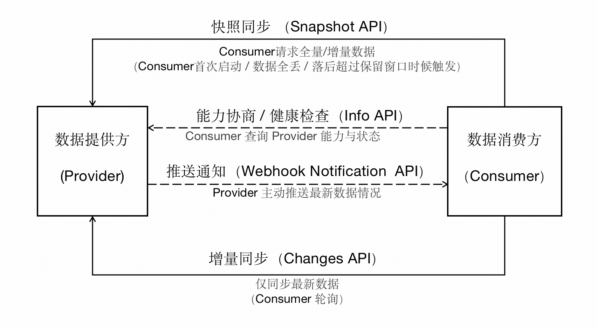

[首页](../README.md)

DSP：数据同步协议（ACPs-spec-DSP-v02.00）

# 1. 文档定义

本文档为 ACPs 智能体协作协议体系中的数据同步协议（Data Synchronization Protocol, DSP）标准定义，版本号 v02.00。

文档全称为 ACPs-spec-DSP-v02.00。

文档编写者：禹可（北京邮电大学），胡晓峰（北京邮电大学），郭小练（北京邮电大学），宋昊哲（北京邮电大学），马镝（北京邮电大学），李珂（北京邮电大学），刘军（北京邮电大学），陈科良（北京邮电大学）。

# 2. 协议基础概念

本文档是描述数据提供方（Provider）和数据消费方（Consumer）之间的数据同步协议。
## 2.1. 关键术语

- **快照同步（Snapshot）**：在某一时间点冻结的完整数据视图，供 Consumer 批量拉取。用于初始化或重建数据状态。
- **全量快照（Full Snapshot）**：快照同步的缺省方式。返回指定类型的全部有效对象。
- **增量快照（Incremental Snapshot）**：快照同步的可选方式。仅返回指定序号之后的数据版本，适合落后不多且业务不发生真实删除的场景。
- **快照分块（Chunking）**：快照同步时将数据拆分为多个 Chunk 顺序传输，避免单个响应过大。每个 Chunk 通过索引标识。
- **增量同步（Changes）**：快照同步之后的增量数据同步，供 Consumer 按 `seq` 顺序持续追赶数据。
- **保留窗口（Retention Window）**：Provider 在提供增量同步（Changes）时，保留数据变更的时间/数量范围。Consumer 当前需要同步的数据如在窗口内，就可以用正常的增量同步（Changes）完成同步。 如果需要同步的数据已经不在窗口内，那就无法再用正常的增量同步（Changes）来完成同步，需重新用快照同步（Snapshot）来完成同步。
- **推送通知（Webhook Notification）**：Provider 主动向 Consumer 发送数据变更通知的机制。增强实时性，减少增量同步（Changes）轮询压力。发送的是变更事件摘要，Consumer 仍需通过增量同步（Changes）获取完整数据。

## 2.2. 主要角色与职责

- **数据提供方（Provider）** 
  数据的源头​​，需要维护数据的完整性、合法性与一致性，并为数据消费方提供可靠的数据基准。主要职责如下：
  - 发布快照同步（Snapshot）API 与增量同步（Changes）API，负责生成一致性数据视图。
  - 维护快照的快照分块（Chunking）能力和清理策略，保证大规模同步的可用性。
  - 管理保留窗口（Retention Window），确保一定时段/数量内的变更可供拉取。
  - 当 Consumer 落后于保留窗口（Retention Window）时，需要支持重新获取快照帮助其追平。

- **数据消费方（Consumer）**  
  依赖数据提供方提供的数据，负责在本地消费与存储。主要职责如下：
  - 通过快照完成初始化或数据恢复，并保证 `(type,id,version)` 幂等写入。
  - 通过增量同步（Changes）API 持续追赶新事件；若收到 `410 Gone` 需自动切换为重新获取快照。
  - 可同时对接多个 Provider，也可能暴露 Webhook 端点以接收变更通知。

---

# 3. 数据同步过程

（1）当数据消费方首次启动、数据丢失或数据长期滞后于数据提供方的数据时，应先调用一次能力协商接口（Info API）获取数据提供方的运行状态与关键配置，据此选择合适的同步策略；随后数据消费方主动请求一次全量/增量快照（Snapshot），完成数据的初始对齐。

（2）完成对齐后进入常态化运行，即数据消费方以增量（Changes）方式持续轮询数据提供方，仅拉取新增或变更的数据，确保实时一致。若对数据同步的时效性要求更高，数据提供方可主动推送变更通知（Webhook Notification），从而降低发现侧的查询压力。

（3）若连接意外中断且时间较长，数据消费方应再次通过 Info API 评估当前保留窗口与服务状态，并在需要时重新拉取全量或增量快照，重新对齐数据，保障双方始终同步。数据提供方–数据消费方的交互概览图如下：



## 3.1 快照（Snapshot）同步

**功能概要**

负责在同步初期或数据失衡时提供一致的批量数据视图，让 Consumer 能够通过全量快照或增量快照迅速拉齐状态，并依靠分块传输与幂等语义保证处理过程稳定可靠。
- 一次性拉齐全量状态：在同步初期或数据严重不一致时，提供某个固定时刻的“数据视图”，让 Consumer 端快速把本地状态对齐到 Provider。
- 稳定可控的大批量传输：支持把大快照拆成多个小块分批拉取，避免单次返回过大带来的网络与处理压力。
- 可重复消费：同一份快照数据允许客户端“重复获取、重复处理”而不会破坏结果，方便断网重试、失败回放。

**实现机制**
- 一致性切点：创建快照时会确定一个“快照切点 `S`”，后续无论拉多少块，看到的都是同一时刻的那份数据。
- 全量与增量两种生成方式：全量快照：生成指定范围内“当前有效”的完整数据集，用于从零初始化或彻底重建；增量快照：从指定起点之后收集变更数据，用于在落后不多时快速追平，显著减少传输与处理成本。
- 分块（Chunking）拉取：创建快照时会返回第一块数据；之后客户端按块索引逐块拉完，并且支持按需调整Chunk大小，以适配网络状况与处理能力。
- 幂等语义：快照内容以可幂等处理的方式输出，客户端可以放心重试同一块、或在失败后重复消费。
- 资源回收：快照是“临时同步资源”，支持客户端主动删除，也支持服务端按“多久没访问/最长存活”自动过期清理；过期后再访问会被明确告知需要重建快照。

**使用场景**：
- 首次初始化（全量快照）：Consumer 从零开始，需要完整同步所有类型的数据。
- 数据重建（全量快照）：数据大范围不一致，直接全量重拉更稳妥。
- 快速追平（增量快照）：Consumer 落后不多，但超出了增量同步（Changes）API 的保留窗口（Retention Window），不想费时做完整重建。
- 删除语义处理：若存在真实删除等情况，增量快照不可靠，应使用全量快照；若采用软删除表达删除意图，则增量快照可正常工作。

---

## 3.2 增量（Changes）同步

**功能概要**

通过按序返回指定位置之后发生的变更，让 Consumer 能够以较小成本持续拉齐最新状态，维持 Consumer 与 Provider 的实时一致性。同时，它也为长轮询（减少空拉取）、限流（保护服务端）、以及**保留窗口**提供统一入口。
- 保持最新状态一致：在完成快照同步后，Consumer 从上次已同步的位置开始，持续拉取后续变更，确保本地数据随时间推进保持一致。
- 按序增量返回：变更数据严格按序输出，Consumer 只需维护最新的全局递增序号，即可稳定、可恢复地推进同步进度。
- 减少空拉取（长轮询）：在没有新变更时，支持在一定时间内保持连接等待新数据，减少频繁轮询带来的请求浪费。

**实现机制**
- 基于“起始位置”的拉取模型：每次请求从一个起始序号之后开始返回变更；客户端在处理完响应后，使用服务端返回的“最新位置”作为下一次请求的起点，形成稳定推进的同步链路。
- 长轮询行为：当客户端声明等待时长时，服务端会在该窗口内等待新变更；有新数据则立即返回，否则在超时后返回“无变更”，同时明确告诉客户端当前位置未推进，便于下一次继续等待或改为短轮询。
- 可恢复与幂等处理：客户端可以在网络抖动或处理失败时安全重试同一轮请求；只要客户端按序推进并避免跳跃更新，就能确保最终一致。
- 保留窗口约束：服务端只保留有限时间/范围内的历史变更；当客户端请求的位置过旧，服务端会返回“已无法补齐”，要求客户端回到快照同步重新建立基线。
- 删除语义处理：增量同步能够表达对象删除等变更，Consumer 需要按变更含义更新本地状态；若业务需要审计，应在删除相关链路中补充审计记录与原因留痕。

**使用场景**
- 快照完成后的常态追更：作为主链路，持续把 Consumer 从某个快照切点之后推进到最新状态。
- 近实时同步需求：当希望延迟更低、空拉取更少，可使用长轮询在低频请求下快速获得新变更。
- 断线重连后的补齐：Consumer 重启或短暂停机后，从上次位置继续追赶；若落后过久超出保留窗口，则采用3.1节的快照同步方式。

---

## 3.3 推送通知（Webhook Notification）

**功能概要**
当数据发生变更时，Provider 可主动通知 Consumer（不是让 Consumer 反复轮询查询），从而显著降低轮询频率，并在增量同步的基础上进一步提升同步的实时性。
- 主动通知，降低轮询：Provider 在有变更时主动回调 Consumer，减少无效拉取与资源消耗。
- 提升实时性：通过即时或批量通知，让 Consumer 更快感知变更并触发拉取处理。
- 可控的通知策略：支持按事件类型配置不同策略（例如业务变更走批量、运维事件走即时），在实时性与负载之间取得平衡。

**实现机制**
- 注册回调端点与关注范围：Consumer 向 Provider 注册回调地址，并声明关注的数据类型与事件范围，Provider 仅推送匹配的通知。

- Endpoint 验证：注册完成后先进行回调可达性与控制权验证；只有验证通过后才开始发送真实事件，避免误配或劫持风险。

- 即时和批量两种通知模式：即时通知用于关键事件快速触达；批量通知用于高频变更合并发送，以降低请求风暴与处理开销。

- 失败与暂停机制：当连续投递失败达到阈值，Provider 可将该 Webhook 标记为不可用并停止重试；需要 Consumer 显式重新激活后才恢复投递，避免长期无效重试。

Consumer 收到通知后，以通知提示的范围与位置为参考，调用 Changes 拉取变更并推进同步进度；若发现已落后超过保留窗口，则退回 Snapshot 重建基线。

**使用场景**
- 高频变更的实时感知：希望减少轮询、提升响应速度的同步场景（例如数据持续更新的在线系统）。
- 混合策略的生产环境：业务变更走批量降低成本，系统维护/保留窗口清理等事件走即时保证可观测性。
- 异常恢复辅助：通过保留窗口清理、维护状态等通知，让 Consumer 更快进入“快照重建/暂停同步/恢复同步”的标准流程。

---

## 3.4. 能力协商和健康检查（Info）

**功能概要**

用于向 Consumer 提供 Provider 的**基础能力说明**与**运行状态**，帮助 Consumer 在初始化阶段完成能力协商与健康检查。通过该接口，Consumer 可以提前确认支持的对象类型、快照与增量同步的关键配置，以及通知能力的运行态指标，从而在同步开始前就调整策略，避免后续流程中出现协议不匹配或能力缺失的问题。

- 能力协商：提供 Provider 支持的对象类型与关键能力开关，Consumer 可据此决定需要同步哪些数据、选择哪些同步方式（例如是否可用增量快照、是否可用长轮询等）。
- 健康检查与可用性判断：明确服务当前是否可用（正常/维护），避免在不可用状态下反复发起快照或增量请求。
- 同步策略预判：在开始同步前就拿到快照过期策略、增量保留窗口等关键信息，Consumer 能够更合理地设置拉取节奏、重试与回退策略（例如何时必须回退到快照重建）。
- 运维与容量参考：可选提供快照与通知相关的运行态指标，辅助判断当前资源压力与系统状态，便于排查异常或规划调用频率。

**使用场景**
- 启动初始化：Consumer 启动时首先调用 Info API，确认服务可用、对象类型范围与能力开关，再决定走快照同步还是直接增量追赶。
- 策略调整：周期性低频调用（或在错误/降级时调用）Info API，以更新缓存配置，动态调整长轮询等待时长、批量大小、重试与退避策略等。
- 异常排查与运维联动：当出现持续 410（落后过久）、快照频繁过期、Webhook 大量失败等现象时，Info API 可作为快速定位的“事实来源”，帮助判断是配置问题、能力不支持还是服务状态变化。

---

# 4.关键数据

## 4.1. 基础数据模型（Envelope）

所有传输的数据都使用统一的信封（Envelope）结构，保证幂等与可适配性。

- **​ 幂等性**​​：指同一操作无论执行多少次，结果均与一次执行一致，避免重复处理导致的数据不一致。例如，Consumer 重复拉取全量快照时，通过 seq（全局递增序号）判断数据是否已同步，重复数据将被自动跳过，确保本地数据不会因重复操作而冗余。
- **​可适配性**​​：指基础数据模型能随业务需求变化灵活扩展，无需修改整体结构即可支持新增字段或功能。

```typescript
export interface Envelope {
  /**
   * 全局递增序号（推荐64位长整型）。
   *
   * seq具有全局性，可以跨多个不同的对象类型(type)的数据变更，seq 保证在全局范围内单调递增。
   *
   * 使用 string 类型以避免不同语言之间的精度丢失。比如：超过 2^53-1 的整数在 JavaScript 中会丢失精度。
   * 能够支持64位整数的语言内部用真正的 64 位整数，不能支持的语言用字符串。跨语言传输使用字符串。
   * @example "42001"
   */
  seq: string;

  /**
   * 变更时间戳（可选）
   * 使用 ISO 8601 格式，包含时区信息。推荐使用北京时间，方便用户查看和理解。
   *
   * 这个时间戳在数据库中必须是有的，主要用于计算数据是否超出了Retention Window的过期时间。
   * 但是在 API 中可以选择不返回。
   * @example "2025-08-17T13:12:19+08:00"
   */
  ts?: string;

  /**
   * 操作类型（可选）
   * 缺省为upsert，表示插入或更新。
   * 有些业务场景是真实的删除了数据，此时才需要delete，
   * 大多数软删除的场景不需要delete，因此可以省略。
   * @example "upsert"
   */
  op?: "upsert" | "delete";

  /**
   * 对象类型
   * @example "dataset"
   */
  type: string;

  /**
   * 对象全局唯一ID
   * @example "urn:reg:abc:dataset:123"
   */
  id: string;

  /**
   * 对象版本号，数字。
   * 用于标识同一对象的不同版本，与 type、id 一起构成幂等性保证的三元组 (type, id, version)。
   * 如果使用字符串，那么字符串"2", "10"进行比较，结果是"2" > "10"，这与常识不符。所以我们强制要求使用数字类型。
   * @example 42
   */
  version: number;

  /**
   * 实际数据
   * 可以是完整对象数据（FULL_JSON）或对象的部分更新数据（JSON_PATCH）
   */
  payload: any;
}
```

**特点**
- `seq` 必须单调递增，不可重复，但是不需要连续。
- `seq` 推荐为 64 位长整型，确保足够大的序号空间。但是跨语言传输时使用字符串，避免精度丢失。
- 以 `(type, id, version)` 三元组作为幂等性保证。

**Payload 类型**
Payload 字段可以有不同的类型，取决于具体实现。可以通过 `info` 的 API 端点查询当前支持的类型。

- **FULL_JSON**：完整对象数据，包含所有字段。快照同步（Snapshot）API 中只能使用这种类型。
- **JSON_PATCH**：对象的部分更新数据，只包含变更的字段。只能用在增量同步（Changes）API。

JSON_PATCH 的格式需要遵循 [RFC 6902 — JSON Patch 规范](https://datatracker.ietf.org/doc/html/rfc6902)。


快照同步（Snapshot）API 的 payload 只能是 FULL_JSON 类型，而增量同步（Changes）API 的 payload 可以是 FULL_JSON 或 JSON_PATCH。

## 4.2. 其它基础数据模型

```typescript
export interface CommonResponse {
  /**
   * 响应状态
   * 表示请求处理的结果，可能的值包括 "ok" 和 "error"。
   * @example "ok"
   */
  status: "ok" | "error";

  /**
   * 方法调用的结果
   * 如果调用成功则包含结果，与error字段相互排斥。
   * @example { "type": "task", "id": "task-001" }
   */
  result?: any;

  /**
   * 错误信息
   * 如果调用失败则包含错误对象，与result字段相互排斥。
   */
  error?: {
    /**
     * 错误代码
     * @example -32602
     */
    code: number;

    /**
     * 错误消息
     * 描述错误的简要信息。
     * @example "Invalid Request"
     */
    message: string;

    /**
     * 可选的错误数据
     * 提供更多的错误细节和上下文信息。
     * @example { "errorType": "CONNECTION_FAILED" }
     */
    data?: any;
  };
}
```

---

# 5.接口设计

本数据同步协议涉及的 API 如下表所示：

| API 名称           | 核心作用                                                                      | 适用场景                                                                 |
| ---------------- | ---------------------------------------------------------------------------------- | -------------------------------------------------------------------- |
| Snapshot API     | 提供一致性快照视图用于批量同步；支持全量/增量快照；支持 Chunking 分块拉取                                         | 初始化/首次接入；数据重建（本地库丢失/污染）；追赶失败且落后过多时回到快照；超出 Retention Window（410）后重新拉齐 |
| Snapshot Chunk   | 基于 `snapshotId + chunk_index` 拉取指定分块；支持重试同一块（幂等）                                   | 大数据量快照分块传输；网络/处理能力受限时调整 `chunk_size`；失败后按块重试                         |
| Snapshot Delete  | Consumer 主动删除快照资源，释放 Provider 存储/缓存（幂等返回 204）                                      | 快照消费完成后主动清理；避免等待服务端自动过期回收                                            |
| Changes API      | 按 `start_seq` 拉取增量变更；可选长轮询 `wait`；用 `X-Changes-Last-Seq` 推进游标                      | 常态持续追赶；需要更实时用长轮询减少空拉取；多类型变更合并拉取                        |
| Webhook 管理 API   | 注册/更新/删除/查询 Webhook 与通知策略（batch/immediate）；支持重激活                                   | 降低 Changes 轮询压力；按事件重要性配置通知策略；运维查询/排障/恢复 failed webhook               |
| Webhook Callback | Provider 主动推送变更事件摘要（不含全量数据）；Consumer 收到后再拉取 Changes/Snapshot                       | “有变化才拉取”；提升实时性；收到 retention/维护类事件后触发补救或运维流程                          |
| Webhook Verify   | 回传 challenge 或手动触发验证，确认回调端点可达与归属；验证后才投递业务事件                                        | 新建 Webhook；更新 URL/关键配置后重新验证；未收到验证事件时手动触发                             |
| Info API         | 查询 Provider 能力与运行状态 | 初始化能力协商；健康检查；根据 retention/能力动态调整同步策略                                 |

