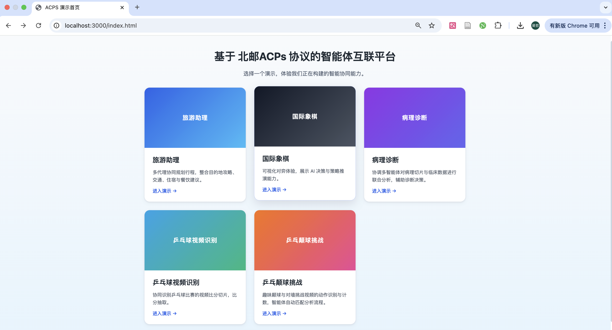

[首页](../README.md)

# 1.ACPs协议细节
所有ACPs协议文档均可通过 [协议文档汇总](../README.md) 访问。

# 2.demo使用

为了您快速体验ACPs协议，我们提供了一个demo，其代码仓库位于 [demo-app]()。这里我们提供了能快速体验demo的流程。

## 环境准备

```
python3.13+
poetry
acps-sdk
demo-app
```

**首先克隆acps-sdk代码仓库并完成相应配置**

```bash
git clone [acps-sdk-url]
```

**克隆demo代码仓库**

```bash
git clone [demo-url]
cd demo-apps
```
**创建虚拟环境并安装依赖**

```bash
python3 -m venv venv
source venv/bin/activate
poetry install
```
如果在配置环境中出现`The current project could not be installed`错误，请进入`demo-apps/pyproject.toml`文件,在`[tool.poetry]`下添加`package-mode = false`字段，并再次运行`poetry install`

**目录结构**

```
your_workspace/
├── acps-sdk/
├── demo-apps/
```

**配置RabbitMQ（可选）**
如果想体验AIP的群组模式，还需要配置RabbitMQ服务，可参考[此文档](gettingstarted/配置MQ.md)

**准备配置文件：**

```bash
# 准备leader的配置文件
cp leader/config.example.toml leader/config.toml
# 准备partner的配置文件(在这里直接创建所有partner的配置文件)
find partners/online -name "config.example.toml" -type f | while read file; do cp "$file" "${file%.example.toml}.toml"; done
# 重要：需要在创建的config.toml中根据实际情况对LLM Profile, Server Port, Discovery URL等进行配置
```

**启动全部 Agent 与演示服务（首次运行可先确认证书路径等）：**

```bash
./start.sh
```

**在浏览器验证 Leader：**

用浏览器访问 `http://localhost:3000`。您可以看到如下界面，您可以体验其中的所有demo演示。




**查看运行日志：**

- 每个子服务在 `logs/` 下记录日志。
- 若需查看所有服务的日志，可运行 `tail -f logs/*.log`。


