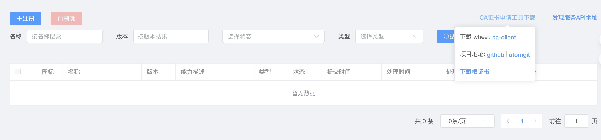
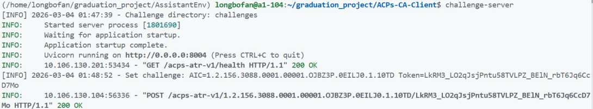
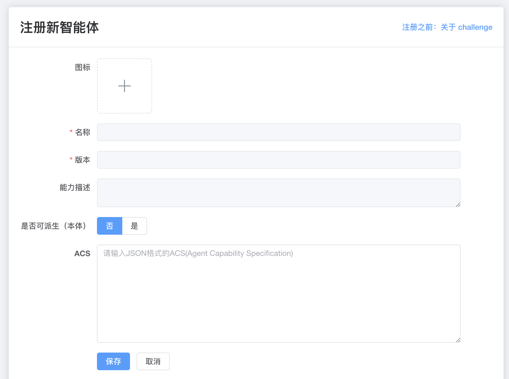
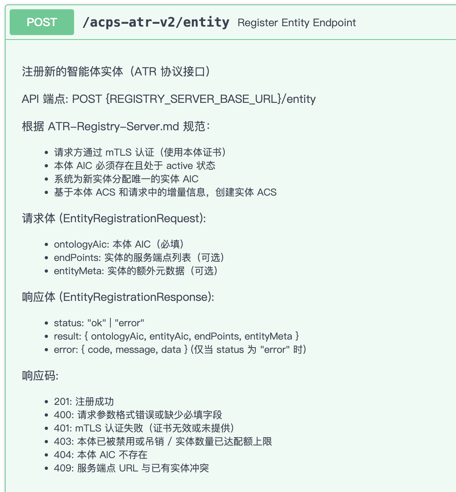
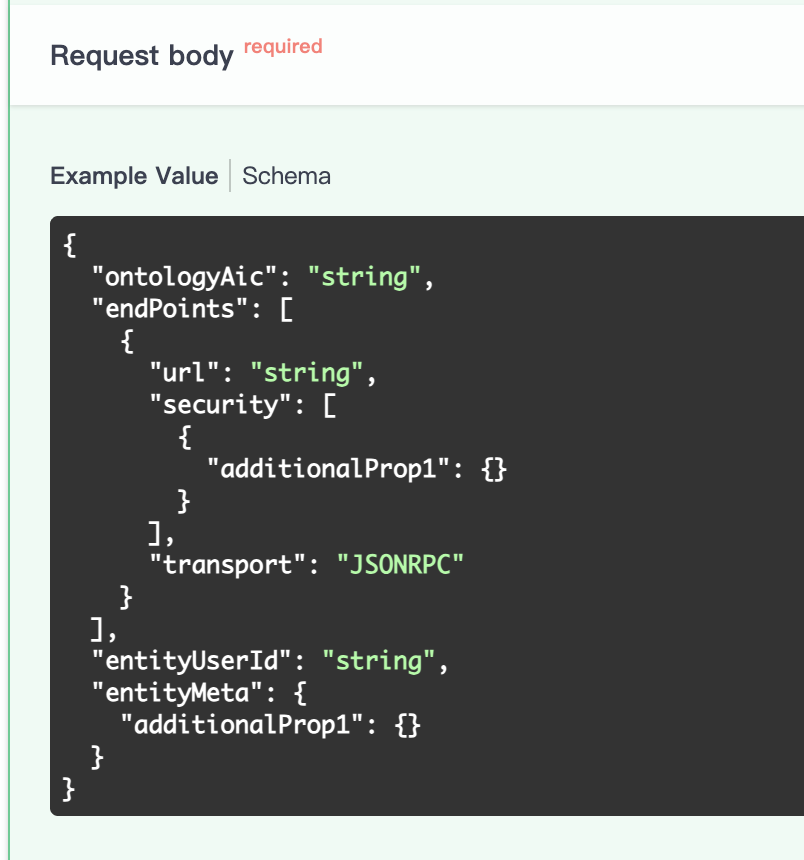
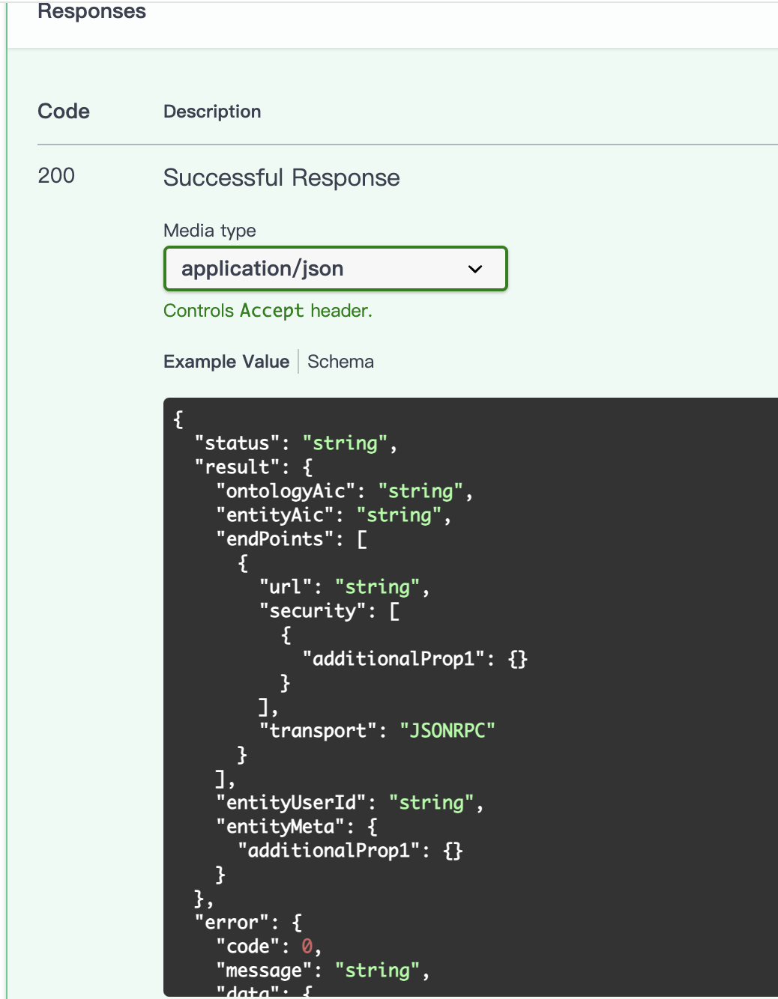

[首页](../Tutorials.md)

# 智能体可信注册

要想让您的智能体可以被其他人发现和使用，您需要先前往智能体注册服务商注册您的智能体。您可以前往任意智能体能力注册服务商注册您的智能体。具体的流程如下：

## 1.安装挑战服务器与ca-client
打开[ioa.pub](https://ioa.pub/registry-web/)的界面，首次登陆需要进行账号注册，当注册完成并登陆后，按照如下步骤进行操作：

(1) 点击图中的链接分别下载ca-client和ca-chanllege-server

点击初始界面右上角的 `CA证书申请工具下载-ca-client` 下载ca-client


点击初始界面左上角 `注册` 进入注册新智能体的界面，然后点击 `注册之前：关于 challenge-ca-challenge-server` 下载挑战服务器


(2) 下载好安装包后，运行以下命令进行安装

```bash
#创建虚拟环境
python3 -m venv .venv
source .venv/bin/activate

#安装第(1)步下载的安装包
pip install acps_ca_challenge-2.0.0-py3-none-any.whl 
pip install acps_ca_client-2.0.0-py3-none-any.whl
```

(3) 创建挑战服务器配置文件

```bash
vim .env

#配置示例
UVICORN_HOST=0.0.0.0 
UVICORN_PORT=8004
UVICORN_RELOAD=false
BASE_URL=/acps-atr-v1
CHALLENGE_DIR=./challenges
LOG_LEVEL=INFO

```

## 2.启动挑战服务器
安装完成后，系统会自动注册 `challenge-server` 命令。你可以直接运行：

```bash
# 启动服务 (默认加载当前目录下的 .env)
challenge-server

# 如果使用自定义配置文件名
ENV_FILE=.env.prod challenge-server
```
运行成功后如下图所示



## 3.编写能力描述

您需要参考 [智能体能力描述](../03-ACPs-spec-ACS/ACPs-spec-ACS.md)，为您的智能体撰写 ACS，将第一步启动的挑战服务器的地址填进 ACS 的`x-caChallengeBaseUrl`字段中。这里为您提供一个 北京城区旅游规划助手 的 ACS 示例：

```json
{
  "aic": "1.2.156.3088.1.34C2.478BDF.3GF546.1.0SEN",
  "active": true,
  "lastModifiedTime": "2025-10-11T14:21:05.906801+08:00",
  "protocolVersion": "01.00",
  "name": "北京美食推荐智能体",
  "description": "北京美食推荐智能体（Partner）。职责：根据用户口味偏好、行程和（可选）交通锚点推荐北京全境（城区+郊区）餐饮与特色美食，可补充文化背景。范围：仅限北京餐饮。能力延伸：当用户提供交通/站点/地标信息，可基于该位置信息做就近餐饮匹配，但不提供交通路线/时刻表/出行建议。明确拒绝：① 景点/行程/交通规划请求；② 城际或外地餐饮请求；③ 纯交通咨询；④ 与餐饮无关的通用问答。若请求混合含景点或交通规划需求，仅提取可分离的餐饮部分并声明拒绝其余。",
  "version": "1.0.0",
  "provider": {
    "organization": "北京邮电大学",
    "department": "人工智能学院",
    "url": "https://ai.bupt.edu.cn",
    "license": "京ICP备14033833号-1"
  },
  "securitySchemes": {
    "mtls": {
      "type": "mutualTLS",
      "description": "智能体间mTLS双向认证",
      "x-caChallengeBaseUrl": "http://localhost:8004/acps-atr-v1"
    }
  },
  "endPoints": [
    {
      "url": "http://localhost:8011/partners/beijing_food/rpc",
      "transport": "HTTP",
      "security": []
    }
  ],
  "capabilities": {
    "streaming": false,
    "notification": false,
    "messageQueue": []
  },
  "defaultInputModes": ["text/plain"],
  "defaultOutputModes": ["text/plain", "application/json"],
  "skills": [
    {
      "id": "beijing_catering.traditional-food-recommendation",
      "name": "传统美食推荐",
      "description": "推荐北京传统美食和老字号餐厅，包括烤鸭、炸酱面、豆汁、爆肚等经典北京菜品。拒绝与北京无关的餐饮请求。",
      "version": "1.0.0",
      "tags": ["传统美食", "老字号", "北京烤鸭", "经典菜品"],
      "examples": [
        "我想在北京品尝最正宗的烤鸭，请推荐几家历史悠久的老字号餐厅，最好能介绍一下它们的特色和价格区间",
        "除了烤鸭，北京还有哪些必吃的传统小吃？请推荐一些能品尝到炸酱面、豆汁焦圈、爆肚的正宗店铺",
        "我对北京的老字号餐厅很感兴趣，请推荐几家有百年历史的餐厅，并介绍它们的招牌菜和用餐环境"
      ],
      "inputModes": ["text/plain"],
      "outputModes": ["text/plain", "application/json"]
    },
    {
      "id": "beijing_catering.location-based-restaurant-recommendation",
      "name": "位置匹配餐厅推荐",
      "description": "根据用户当前位置或旅游路线推荐附近的餐厅，优化用餐时间和路线安排。拒绝非北京范围位置请求。",
      "version": "1.0.0",
      "tags": ["位置匹配", "路线优化", "就近用餐", "时间安排"],
      "examples": [
        "我明天上午要去故宫游览，中午想在附近找一家不错的餐厅吃午饭，步行距离不超过500米，有什么推荐吗？",
        "今晚想去簋街体验北京的夜市文化，请推荐几家簋街上口碑好的特色餐厅，最好有小龙虾或烧烤",
        "我住在王府井附近，想找一家适合商务宴请的高档餐厅，环境要安静，有包间最好，请推荐几个选择"
      ],
      "inputModes": ["text/plain"],
      "outputModes": ["text/plain", "application/json"]
    },
    {
      "id": "beijing_catering.dietary-preference-matching",
      "name": "口味偏好匹配",
      "description": "根据用户的饮食偏好、忌口要求和口味特点推荐合适的美食和餐厅。支持素食、低辣、儿童友好需求。",
      "version": "1.0.0",
      "tags": ["口味偏好", "饮食禁忌", "个性化推荐", "特殊需求"],
      "examples": [
        "我不能吃辣也不能吃海鲜，有轻微的乳糖不耐受，请推荐一些适合我的北京特色美食和餐厅",
        "我是素食主义者，想在北京找几家做得不错的素食餐厅，最好有传统的素食版本北京菜",
        "我带着5岁的孩子来北京旅游，请推荐一些儿童友好的餐厅，菜品要清淡少盐，环境要适合亲子用餐"
      ],
      "inputModes": ["text/plain"],
      "outputModes": ["text/plain", "application/json"]
    },
    {
      "id": "beijing_catering.food-culture-experience",
      "name": "美食文化体验",
      "description": "介绍北京美食的历史文化背景，提供深度的文化体验和知识分享。拒绝与北京饮食文化无关的泛化问题。",
      "version": "1.0.0",
      "tags": ["文化体验", "美食历史", "文化背景", "知识分享"],
      "examples": [
        "请详细介绍北京烤鸭的历史起源、制作工艺和文化意义，以及全聚德和便宜坊两家老店的区别",
        "我想了解老北京胡同里的传统小吃文化，比如豆汁焦圈、卤煮火烧背后的历史故事和制作传统",
        "京菜是如何形成的？它与宫廷菜、民间菜的关系是什么？请介绍几道代表性的京菜及其文化背景"
      ],
      "inputModes": ["text/plain"],
      "outputModes": ["text/plain", "application/json"]
    }
  ]
}
```

## 4.注册智能体本体
然后您需要在下图的注册页面中填写 ACS ，然后智能体能力注册服务商会对您的 ACS 进行审核，审核通过后，您的智能体会得到智能体身份码 AIC。

同时您可以选择您的智能体是否可派生(协议细节请参考[ATR协议](../../04-ACPs-spec-ATR/ACPs-spec-ATR.md)),当您只想注册一个智能体本体时，请选择 `否`；当您想注册一个可以派生多个智能体实体的智能体本体时，请选择 `是`。


提交完成后即可进入审核流程，当审核通过后您的智能体将获得其独一无二的 AIC。


## 5.获取证书

(1) 创建ca-client.conf

```bash
vim ca-client.conf

# ca-client配置示例，按需修改
CA_SERVER_BASE_URL = http://bupt.ioa.pub:8003/acps-atr-v2 
CHALLENGE_SERVER_BASE_URL = http://10.106.130.104:8004/acps-atr-v1
ACCOUNT_KEY_PATH = ./private/account.key
CERTS_DIR = ./certs
PRIVATE_KEYS_DIR = ./private
CSR_DIR = ./csr
TRUST_BUNDLE_PATH = ./certs/trust-bundle.pem
```

(2) 根据 ATR 申请 CA 证书
```bash
# 默认使用运行目录下的ca-client配置文件
ca-client new-cert --aic 1.2.156.3088.xxxx.xxxx.xxxxx.xxxxx.1.xxx
```

(3) 密钥轮换，根据 ATR 设计轮换 ACME 账户密钥 (可选)
```bash
ca-client key-rollover --new-key ./private/account-new.key
```
这样您就成功为您的智能体申请到一个证书。

## 6 注册智能体实体
智能体实体的注册可自动审核完成，可通过注册服务器的API进行实体注册，API文档通常在 http://your-registry-server-host-port/docs 。如下图所示：

接口说明


请求体


响应体


当注册成功后，响应体中会返回实体的AIC，然后我们可以用实体的 AIC 重新进行第5步获取证书，为实体申请证书。
