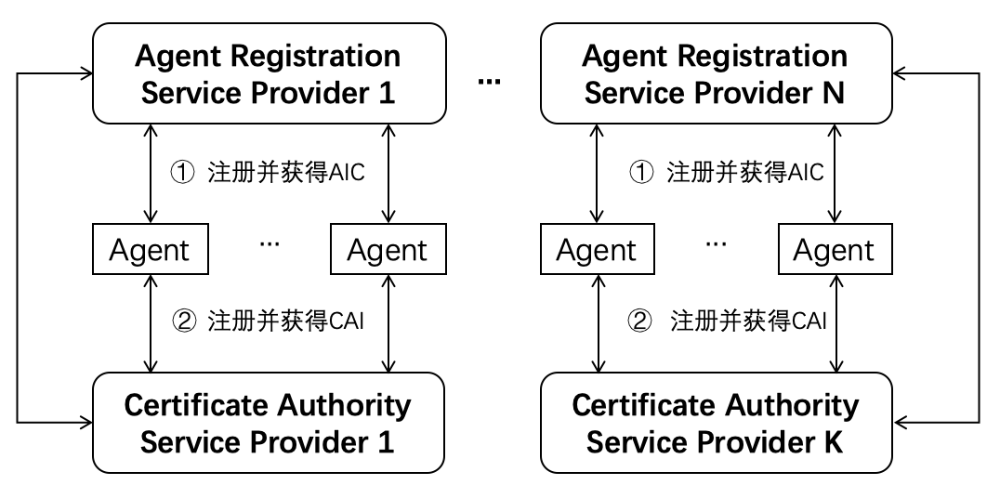
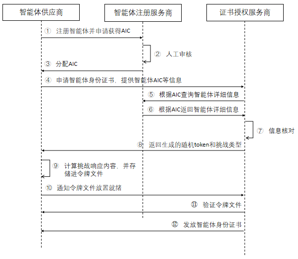
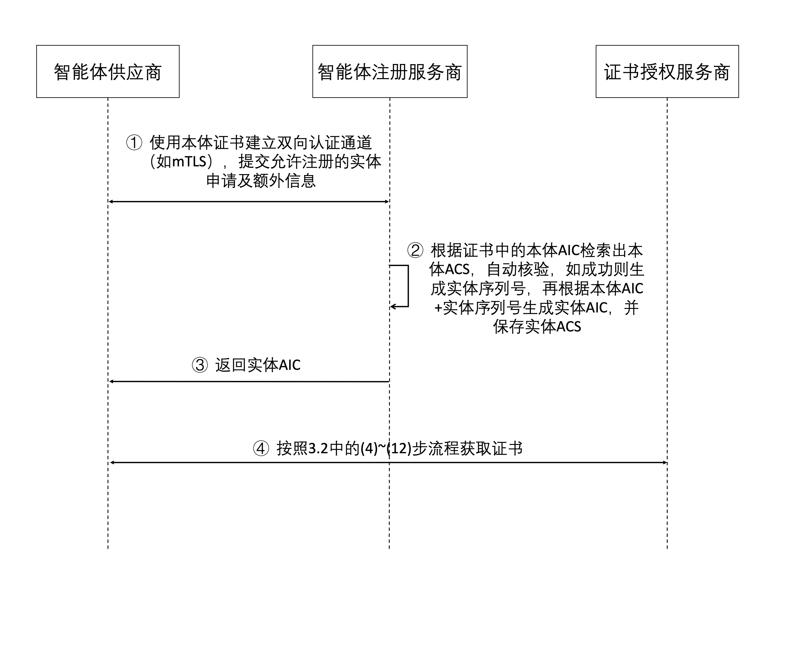

[首页](../README.md)

ATR：智能体可信注册（ACPs-spec-ATR-v02.01）

# 1. 文档定义

本文档为 ACPs 智能体协作协议体系中的智能体可信注册（Agent Trusted Registration ，ATR）流程定义，版本号 v02.01。

文档全称为 ACPs-spec-ATR-v02.01。

文档编写者：刘军（北京邮电大学），宋昊哲（北京邮电大学），李胤铭（北京邮电大学），李珂（北京邮电大学），禹可（北京邮电大学），胡晓峰（北京邮电大学），马镝（北京邮电大学），陈科良（北京邮电大学），高歌（中国电子技术标准化研究院）。

# 2. 智能体注册流程介绍

智能体互联要能成为一个安全可靠的智能体系统，运行于其中具备自主执行任务能力的智能体应为安全可靠的实体。要达到这一目标，每个智能体应具备以下两个必要条件：

(1) 从智能体注册服务商获得全局唯一的身份标识，该标识为智能体身份码（Agent Identity Code，AIC，参见 ACPs 协议体系中的 AIC 标准定义文档）；

(2) 从智能体注册服务商指定的证书授权服务商获得可用于身份验证的数字证书，称为智能体身份证书（Certificate of Agent Identity，CAI）。

满足以上两个条件的智能体注册流程，可称之为智能体可信注册流程。

在 ACPs 协议体系中的 AIC 标准定义文档中已经定义，每个智能体应具备一个唯一的 AIC，其来自于智能体首次注册的智能体注册服务商（Agent Registration Service Provider，ARSP）。在智能体互联中，可以存在多个智能体注册服务商，每个服务商应为经过共识认可（例如管理机构认证）的服务实体。每个智能体可以根据自身需要，选择不同的智能体注册服务商（ARSP）进行注册，并获得分配的 AIC。

智能体获取 AIC 后，还需从证书授权服务商（Certificate Authority Service Provider, CASP）获取智能体身份证书。在智能体互联中，可以存在多个证书授权服务商，每个服务商应为经过共识认可（例如管理机构认证）的服务实体。完整的可信注册过程如下图所示。

# 3. 智能体可信注册流程定义

## 3.1 智能体本体与实体概念说明

在 ATR 系统中，智能体的 AIC 分为**本体 AIC** 和**实体 AIC** 两种类型：

- **本体（Ontology）**: 类似于编程中的 Class 定义，代表智能体的抽象定义和能力规范。本体 AIC 的第8级智能体实体序列号为 0 。
- **实体（Entity）**: 类似于运行时的 Instance，代表实际运行的智能体服务实例。实体 AIC 也是完整的AIC，其第8级智能体实体序列号部分为非零值，用于区分同一本体下的不同实体。

根据 AIC 规范（ACPs-spec-AIC），实体序列号占用 9 位（oid 第 8 级），采用 36 进制编码。每个本体最多可注册约 **101.5 万亿**（36^9 ≈ 1.01 × 10^14）个实体。

## 3.2 智能体本体注册流程

智能体本体可信注册详细流程如下图所示，对于只需要单个智能体的场景，智能体供应商可以通过以下流程进行本体与实体一体化注册，可直接为该实体AIC申请证书；对于同一个智能体需要启动多个实体的情况，需要按照以下流程单独为自己的智能体本体进行注册，再通过3.3中的智能体实体注册流程进行实体注册。

图中所示步骤如下：

(1) 智能体供应商向智能体注册服务商发送注册请求注册智能体，请求中需包含 ACS 信息，申请获取 AIC；

(2) 智能体注册服务商对注册请求的内容进行人工审核；

(3) 智能体注册服务商审核通过后，为智能体分配 AIC；

(4) 如果智能体供应商是首次在证书授权服务商（运行 CA Server）申请证书，需要先从智能体注册服务商申请获取 EAB（External Account Binding）凭证，再使用 CA Client 工具向 CA Server 注册 ACME 账户（注册时携带 EAB 凭证，将 ACME 账户与 AIC 绑定）。然后使用 CA Client 工具向 CA Server 申请智能体身份证书，请求中需附带 AIC 及证书预期用途（clientAuth 或 serverAuth）；

(5) CA Server 根据智能体 AIC 向智能体注册服务商请求获取智能体的详细信息；

(6) 智能体注册服务商根据 AIC 返回智能体详细信息给 CA Server。返回的详细信息中需包含 AIC、provider 信息及智能体 ACS（包含 `certificate.altNames`、`certificate.requestedValidity` 等证书相关配置）；

(7) CA Server 对智能体详细信息进行核对；

(8) 信息核对通过后，CA Server 核验 ACME 账户注册时携带的 EAB（External Account Binding）凭证，确认该 ACME 账户已与对应 AIC 绑定（EAB 凭证由智能体供应商在步骤 (4) 中从智能体注册服务商申请获取）；

(9) EAB 核验通过后，CA Server 为智能体 AIC 创建 ACME Order；CA Server 从步骤 (6) 获取的 ACS 中读取 `certificate.altNames`（自定义 SAN 配置）和 `certificate.requestedValidity`（请求有效期，单位：天）；

(10) CA Server 为 Order 中的标识符创建 Authorization 对象；由于 EAB 凭证在 ACME 账户注册时已完成 AIC 所有权验证，Authorization 直接标记为有效，无需执行 HTTP-01 挑战验证步骤；

(11) Order 状态进入 `ready` 后，CA Client 生成密鑰对和 CSR 并提交给 CA Server，CA Server 根据 CSR 及 ACS 信息进行证书签发；

(12) CA Server 根据智能体详细信息构造证书：**CN** 使用 AIC（不附加域名后缀）；**SubjectAlternativeName** 包含 `URI:acps://{AIC}` 协议标识符，以及 ACS 的 `certificate.altNames` 中声明的 DNS/IP SAN；**extendedKeyUsage** 按请求用途单独签发（clientAuth 证书仅含 `clientAuth`，serverAuth 证书仅含 `serverAuth`，两种用途需分别申请）；**有效期** 使用 `certificate.requestedValidity` 指定的天数（超过上限则按上限签发）。最后智能体供应商向 CA Server 发起证书下载请求获取最终的智能体身份证书。

## 3.3 智能体实体可信注册流程

智能体实体可信注册详细流程如下图所示。

(1) 智能体供应商使用3.2中获取的智能体本体证书与智能体注册服务商建立双向认证通道（如mTLS），提交实体注册申请，请求中包含本体AIC和额外信息（如位置）。

(2) 智能体注册服务商根据智能体本体证书中的AIC检索出本体的ACS，自动核验，如成功则生成实体序列号，再根据本体AIC+实体序列号生成实体AIC，最后保存实体的ACS。

(3) 智能体注册服务商向智能体供应商返回新注册的智能体实体的AIC。

(4) 智能体供应商获取AIC后，按照3.2中的(4)~(12)步流程获取证书

# 4. 补充说明

本文档定义的智能体可信注册流程充分考虑了可管理性和兼容性，并无偿提供给相关研发人员和机构参考。我们欢迎从事智能体研发和智能体互联协议制定的其他业界同仁支持并采纳此流程定义，以形成利于互联互通和兼容性好的智能体注册服务。
